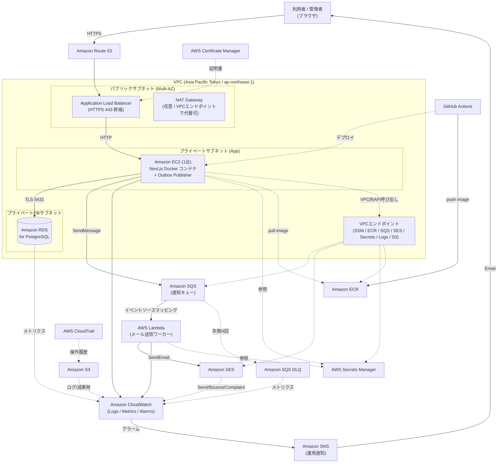
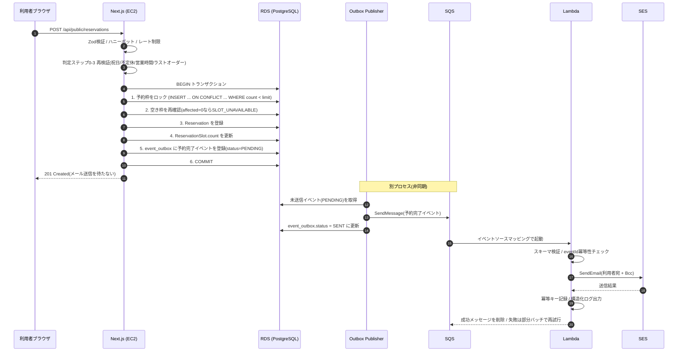
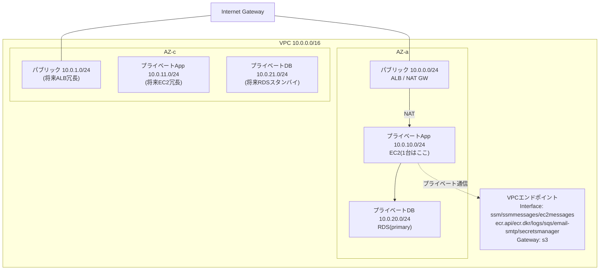
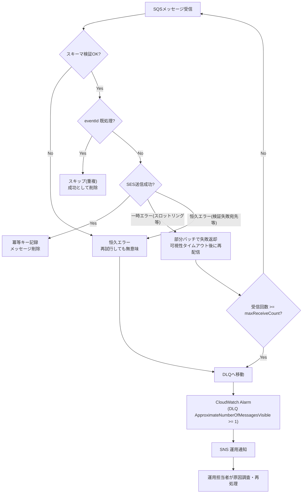
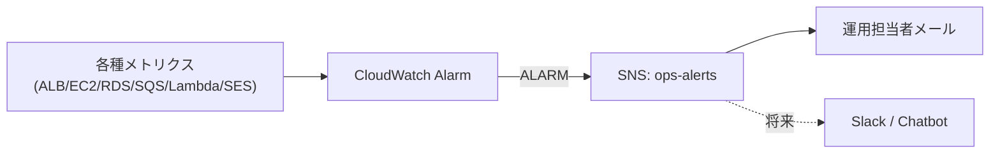
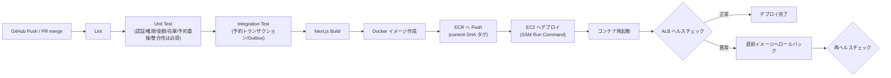
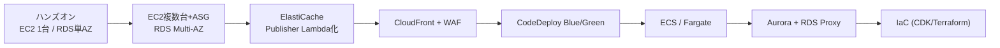

# 本番用AWSアーキテクチャ設計書

尾崎予約システム(Next.js フルスタック再構築版)のAWS本番環境アーキテクチャ設計。

---

## 1. 文書概要

### 1.1 目的と位置づけ

本書は、Angular + CakePHP から Next.js フルスタックへ再構築した予約システムを、Amazon Web Services(AWS)上で本番運用するためのアーキテクチャ設計をまとめたものである。開発担当者がAWS環境を構築・実装できる粒度で、ネットワーク・アプリケーション・非同期メール通知・セキュリティ・監視・CI/CDの各設計を提示する。

本書は**学習・検証(ハンズオン)を主目的**とするため、コストと構築難易度を抑えEC2は1台構成とする。ただし将来的な冗長化・Auto Scalingへ拡張できる設計として整理し、ハンズオン構成と本格運用構成を各章で明確に区別する。

本書はアーキテクチャと実装方針を中心に記述し、アプリケーションの実装コードは含まない。

### 1.2 関連ドキュメント

| ドキュメント | 本書との関係 |
|---|---|
| `docs/requirements/current-requirements.md` | 業務要件・MVP範囲。本書のアプリケーション設計の前提。 |
| `docs/design/db-schema.md` | DB設計(Prisma + PostgreSQL)。本書9章(データベース設計)の前提。 |
| `docs/design/api-design.md` | API設計。**メール送信方式に本書との差分がある(後述)**。 |
| `docs/design/data-migration.md` | 旧DB移行計画。本書のRDS初期データ投入の前提。 |
| `prisma/schema.prisma` | 実際のPrismaスキーマ。本書9章の基準。 |

### 1.3 既存設計との重要な差分(メール送信方式)

`docs/design/api-design.md` の7章では、予約確定のDBトランザクションをコミットした後、**Route Handler内から直接メール送信サービス関数(nodemailer)を同期的に呼び出す**設計になっている。現在のMVP実装(`mvp/feature/reservation-mvp` ブランチ、`.env` の `MAIL_HOST`/`MAIL_PORT`/`MAIL_BCC` 等)もこの同期方式に沿っている。

本書のAWS本番アーキテクチャでは、この予約完了メール通知を **`event_outbox` テーブル + Amazon SQS + AWS Lambda + Amazon SES による非同期方式**へ変更する。

これは「MVPの現在の実装(同期送信)」から「本番運用を見据えた将来アーキテクチャ(非同期Outbox方式)」への**意図的な進化**であり、設計間の矛盾ではなく段階的な発展として扱う。この差分の詳細と移行方針は22章(制約・リスク)および23章(今後の検討事項)に明記する。

---

## 2. システムの目的

### 2.1 業務上の目的

利用者(患者)がWeb上のカレンダーから、拠点(日向 / 延岡)ごとの空き状況を確認し、来店予約を登録できるようにする。予約確定時には利用者と運用担当者(Bcc)へ確認メールを自動送信する。管理者は管理画面から予約一覧の確認・キャンセル・営業設定・不定休・祝日を管理する。

### 2.2 技術上の目的(本書のスコープ)

- 予約登録処理の**データ整合性**(予約枠の重複確保防止)をトランザクションで担保する。
- メール通知を**非同期化**し、通知処理の遅延・失敗が予約登録のレスポンスやDBロック保持時間に影響しないようにする。
- 本番運用に必要な**セキュリティ・監視・ログ・バックアップ・CI/CD**をAWSマネージドサービスで構成する。
- ハンズオンとして**低コスト・低難易度**で構築でき、かつ本格運用へ**段階的に拡張**できる設計とする。

---

## 3. 前提条件

### 3.1 確定している前提

| 項目 | 値 | 根拠 |
|---|---|---|
| アプリケーション | Next.js(App Router)フルスタック | 再構築方針 |
| ORM | Prisma | `prisma/schema.prisma` |
| データベース | PostgreSQL | `db-schema.md`(Amazon RDS for PostgreSQL を採用) |
| タイムゾーン | Asia/Tokyo | 要件ドキュメント4章、`data-migration.md` |
| 拠点 | 日向(HYUGA)/ 延岡(NOBEOKA)の2拠点 | 要件I章 |
| 認証 | 管理画面のみ(Auth.js Credentials + JWT)。公開予約APIは認証なし | `api-design.md` 6章 |
| メール通知 | 予約確定時に利用者宛 + Bcc(運用担当者)へ送信。**継続必須の業務要件** | 要件3-5 |
| デプロイ単位 | Dockerコンテナ | 本書のCI/CD前提 |

### 3.2 ハンズオン構成の前提

- EC2は**1台構成**とする(可用性リスクは22章で明記)。
- RDSは**シングルAZ**から開始する(Multi-AZは21章の拡張候補)。
- Amazon CloudFront、AWS WAF は**必須構成には含めず**、将来的な追加候補として整理する(21章)。

### 3.3 本書で確定しない事項(推測しない)

以下はこのリポジトリの他ドキュメントに記載がなく、本書では確定せず23章「今後の検討事項」に列挙する。

- 本番のドメイン名、Route 53 のホストゾーン。
- EC2のインスタンスタイプ、RDSのインスタンスクラス、ストレージサイズ。
- 実際のトラフィック見込み(同時アクセス数、ピーク時間帯)。
- SESの送信元ドメイン、日次送信上限の必要量。
- メール配信手段の最終選定(`api-design.md` 11章の未決事項3を引き継ぐ。本書ではSESを採用する前提で設計)。

---

## 4. システム構成概要

### 4.1 処理の流れ(概要)

1. 利用者はNext.jsの予約画面から空き状況を確認し、予約を登録する。
2. Next.js は Amazon EC2 上でDockerコンテナとして動作し、予約情報を Amazon RDS(PostgreSQL)へ保存する。
3. 予約登録は**単一DBトランザクション**内で、予約枠のロック・空き確認・予約登録・予約枠更新・`event_outbox` への予約完了イベント登録までを行いコミットする。**トランザクション内からSQS/SESを直接呼び出さない**。
4. Outbox Publisher が未送信イベントを取得し、予約完了イベントを Amazon SQS へ送信する。
5. SQSをトリガーに AWS Lambda が起動し、Amazon SES で予約完了メールを送信する。
6. アプリケーションログ、Lambdaログ、AWSサービスの監視情報は Amazon CloudWatch へ集約する。
7. 規定回数失敗したメッセージは Dead Letter Queue(DLQ)へ移動し、Amazon CloudWatch Alarm と Amazon SNS で運用担当者へ通知する。

### 4.2 責務分担

| コンポーネント | 責務 |
|---|---|
| Next.js(EC2) | 予約画面、予約API、入力値検証、空き確認、予約登録、予約枠更新、Outboxイベント登録、SQSへのイベント発行(Outbox Publisher) |
| Amazon RDS | 予約データ・マスタデータ・`event_outbox` の永続化、トランザクション整合性 |
| Amazon SQS | 予約完了イベントの非同期バッファリング、再試行、DLQ |
| AWS Lambda | SQSメッセージ検証、冪等性制御、SESでのメール送信、結果ログ出力 |
| Amazon SES | メール配信(SPF/DKIM/DMARC、バウンス/苦情管理) |
| Amazon CloudWatch / SNS | 監視・アラーム・通知 |

---

## 5. AWSサービス一覧

### 5.1 基本構成(本書で採用)

| サービス | 用途 | 採用理由 |
|---|---|---|
| Amazon Route 53 | DNS、ドメイン管理 | ACM/ALBとの統合が容易でヘルスチェックも可能。 |
| AWS Certificate Manager (ACM) | TLS証明書の発行・自動更新 | ALBに無料で証明書を適用でき更新も自動。 |
| Application Load Balancer (ALB) | HTTPS終端、ヘルスチェック、将来の複数台分散 | EC2をプライベート化しつつ公開する標準手段。将来のAuto Scalingにそのまま拡張可能。 |
| Amazon EC2(1台) | Next.jsコンテナ実行環境 | ハンズオンの低コスト・低難易度を優先。 |
| Amazon RDS for PostgreSQL | 予約DB | 既存Prisma設計(PostgreSQL)と一致。マネージドでバックアップ/PITRが容易。 |
| Amazon SQS(標準キュー) | メール通知イベントのバッファ | 予約処理とメール送信を疎結合化。再試行・DLQを標準提供。 |
| Amazon SQS Dead Letter Queue | 処理失敗メッセージの隔離 | 恒久エラーの可視化と再処理のため。 |
| AWS Lambda | メール送信ワーカー | SQSトリガーでサーバーレスに実行、スケールが容易。 |
| Amazon SES | メール配信 | AWSネイティブでSPF/DKIM/DMARC・バウンス管理が可能。 |
| Amazon CloudWatch | ログ・メトリクス・アラーム | 全サービスの監視を集約。 |
| Amazon SNS | アラーム通知の配信 | CloudWatch Alarm からの運用通知(メール等)。 |
| AWS Secrets Manager | DB接続情報・SES認証情報等の秘匿管理 | ソース/イメージへの秘密情報混入を防ぐ。 |
| AWS Systems Manager Session Manager | EC2への管理接続 | SSHポートを開けずに安全に接続。 |
| Amazon S3 | デプロイ成果物・ログアーカイブ・バックアップ | 高耐久・低コストのオブジェクトストレージ。 |
| Amazon ECR | Dockerイメージレジストリ | CI/CDからのpush、EC2/Lambdaからのpull。 |
| GitHub Actions | CI/CDパイプライン | 既存のGitHubリポジトリと統合。 |
| AWS CloudTrail | AWS操作履歴の記録 | 監査・セキュリティ要件。 |

### 5.2 将来的な追加候補(本書では必須としない)

| サービス | 用途 | 位置づけ |
|---|---|---|
| Amazon CloudFront | CDN、静的配信高速化、エッジでの保護 | 21章の拡張候補。 |
| AWS WAF | L7ファイアウォール | 21章の拡張候補。 |
| Amazon ElastiCache | レート制限カウンタ・セッション共有 | 複数台化時に必要(21章)。 |
| Amazon DynamoDB | Lambda冪等性管理の別案 | 12章で比較(ハンズオンでは非採用)。 |
| Amazon EventBridge Scheduler | Outbox Publisher の定期起動(本格運用時) | 10章で方式比較のうえ、**本格運用移行時(方式B)にのみ採用**。ハンズオンでは方式A(EC2常駐)を採用するため本書の基本構成には含めない(21章)。 |
| Amazon ECS / AWS Fargate | コンテナオーケストレーション | EC2脱却時(21章)。 |
| Amazon Aurora | 高可用DB | RDSからの移行候補(21章)。 |

---

## 6. 全体アーキテクチャ

### 6.1 AWS全体構成図



### 6.2 予約登録からメール送信までのシーケンス図



---

## 7. ネットワーク設計

### 7.1 設計方針

- VPCを1つ作成する(リージョンは `ap-northeast-1` を想定)。
- サブネットは**3層**に分離する。ALBはパブリック、EC2(App)はプライベート、RDSはプライベートDBサブネットへ配置する。
- 各サブネットは将来のMulti-AZ化を見据え**2つのアベイラビリティゾーン(AZ)にまたがって用意**しておく(ハンズオンでは実リソースは片方のAZにのみ配置してよいが、サブネット自体は両AZに作る。ALBとRDS Multi-AZ化の前提になるため)。
- EC2には**パブリックIPを付与しない**。管理接続はSSHではなく AWS Systems Manager Session Manager を使用する。
- 通信経路は**最小権限**でセキュリティグループ(SG)により制御する(15章と連動)。

### 7.2 VPC・サブネット構成図



### 7.3 セキュリティグループ設計(通信経路)

| SG | インバウンド許可 | アウトバウンド許可 |
|---|---|---|
| `sg-alb` | 0.0.0.0/0 から TCP 443(HTTPS) / 80(HTTPSへリダイレクト用) | `sg-ec2` へ TCP 3000(アプリポート) |
| `sg-ec2` | `sg-alb` から TCP 3000 のみ | `sg-rds` へ 5432、VPCエンドポイント/NATへ 443 |
| `sg-rds` | `sg-ec2` から TCP 5432 のみ | なし(原則) |
| `sg-vpce` | `sg-ec2` から TCP 443 | - |

- **ALBからEC2への通信のみ許可、EC2からRDSへの通信のみ許可**。RDSはインターネットへ非公開(パブリックアクセシビリティ無効)。
- SGはIP指定ではなく**SG参照(source security group)**で相互指定し、スケール時も設定変更が不要な構成にする。

### 7.4 NAT Gateway あり構成 / なし(VPCエンドポイント)構成の比較

EC2がプライベートサブネットにいる場合、以下のAWS API呼び出しに**インターネットまたはVPC内エンドポイント経由の経路**が必要になる。

- SSM Session Manager 接続(`ssm` / `ssmmessages` / `ec2messages`)
- Amazon ECR からのイメージpull(`ecr.api` / `ecr.dkr` / S3(レイヤ取得))
- Amazon SQS API 呼び出し(`sqs`)
- Amazon SES API 呼び出し(`email-smtp` または SES API エンドポイント)
- AWS Secrets Manager 参照(`secretsmanager`)
- CloudWatch Logs 送信(`logs`)

| 観点 | NAT Gateway 構成 | VPCエンドポイント構成 |
|---|---|---|
| 概要 | プライベートサブネットからNAT経由でインターネットの各AWSエンドポイントへ出る | 必要なAWSサービスごとにInterface/Gateway型エンドポイントを張り、インターネットを経由しない |
| 構築難易度 | 低(ルートテーブルにNATを向けるだけ) | 中(サービスごとにエンドポイント作成・SG・プライベートDNS設定が必要) |
| コスト | NAT Gatewayは**時間課金 + データ処理課金**が常時発生し、ハンズオンでも割高になりやすい | Interfaceエンドポイントは**個数×時間課金 + データ処理**。数が多いと積み上がるが、S3(Gateway型)は無料 |
| セキュリティ | AWS宛以外のインターネットへも出られる(経路が広い) | AWSサービスへのプライベート通信に限定され経路が狭い(より安全) |
| 汎用性 | OSパッケージ更新など任意の外部通信も可能 | 張ったサービスにしかアクセスできない |

**本書の推奨(ハンズオン)**: 学習目的で**構築を単純化したい場合はNAT Gateway構成**を採用し、コスト最適化と本番的なセキュリティ境界を学びたい場合は**VPCエンドポイント構成**を採用する。長時間起動しっぱなしのハンズオンでは、NAT Gatewayの時間課金がボディブローになりやすい点に注意する。**本番運用ではVPCエンドポイント構成を基本**とし、OSアップデート等で外部通信が必要ならNATを併用する。検証中はコスト管理のため、使わない時間帯にNAT Gatewayを削除/再作成する運用も選択肢とする。

---

## 8. アプリケーション設計

### 8.1 構成

Next.js(App Router)のフルスタック構成。EC2上でDockerコンテナとして単一プロセスで動作する。担当範囲は以下。

- 予約画面(利用者向けカレンダー・申込フォーム、管理画面)
- 予約API(公開Route Handlers)/ 管理更新系(Server Actions)
- 入力値検証(Zod)
- 予約枠の空き確認(`ReservationSlot.count` と `BusinessHour.reservationLimit` の都度比較)
- 予約登録・予約枠更新
- `event_outbox` テーブルへのイベント登録
- Outbox Publisher(未送信イベントをSQSへ発行する処理)

API/判定/トランザクションの詳細は `docs/design/api-design.md` に準拠する。本書はそのうち**AWS上での実行方式とメール非同期化に関わる差分**を規定する。

### 8.2 予約登録トランザクション(本書での必須要件)

予約登録処理は以下を**単一DBトランザクション内**で実行する。

```
BEGIN
  1. 予約枠をロック(対象30分枠を startAt 昇順で処理)
  2. 空き枠を再確認(上限未満のときだけ確保できる条件付き更新)
  3. 予約情報(Reservation)を登録
  4. 予約枠(ReservationSlot.count)を更新
  5. event_outbox に予約完了イベントを登録(status = PENDING)
  6. COMMIT
```

- **DBトランザクション内からSQSやSESを直接呼び出してはならない**。外部API呼び出しはトランザクション時間を伸ばしロック保持時間を悪化させ、かつ「コミット前にメッセージ送信 → ロールバックで予約が消えたのにメールは飛ぶ」という不整合を生む。これを避けるため、トランザクション内ではRDSへのイベント記録(Outbox)のみを行う。
- 排他制御は `INSERT ... ON CONFLICT (place_id, start_at) DO UPDATE SET count = count + 1 WHERE count < :limit` のアトミック条件更新を採用する(`api-design.md` 4.3節の採用案を踏襲)。影響行数が0なら `SLOT_UNAVAILABLE` としてロールバックする。
- デッドロック回避のため、予約確定・キャンセルとも対象スロットを**`startAt` 昇順**で処理する(`api-design.md` 4.4節)。

### 8.3 event_outbox テーブル(本書で追加)

Transactional Outbox パターンを実現するため、Prismaスキーマに以下のモデルを追加する(本書で提案する追加要素。実装はプロダクト化フェーズで行う)。

| カラム | 型 | 説明 |
|---|---|---|
| `id` | BigInt/autoincrement | 主キー |
| `eventId` | UUID(`@unique`) | イベント一意ID。SQSメッセージ・Lambda冪等キーに使用 |
| `eventType` | String | 例: `RESERVATION_CONFIRMED` |
| `aggregateType` | String | 例: `Reservation` |
| `aggregateId` | Int | 例: `reservationId` |
| `payload` | Jsonb | SQSへ送るメッセージ本体(11章のスキーマ) |
| `status` | Enum(`PENDING`/`SENT`/`FAILED`) | 発行状態 |
| `retryCount` | Int | Publisher側の送信試行回数 |
| `occurredAt` | Timestamptz | イベント発生時刻 |
| `sentAt` | Timestamptz? | SQS送信成功時刻 |
| `createdAt` / `updatedAt` | Timestamptz | 監査用 |

- インデックス: `@@index([status, occurredAt])`(未送信取得の効率化)。
- `payload` に含めるのは11章のSQSメッセージ最小項目に限定し、**個人情報は必要最小限**とする(メール本文はLambda側でテンプレートから生成する)。

### 8.4 Outbox Publisher の役割

- `event_outbox` の `status = PENDING` を `occurredAt` 昇順で一定件数取得する。
- 各イベントをSQSへ `SendMessage` し、成功したら `status = SENT`、`sentAt` を更新する。
- SQS送信に失敗したら `retryCount` を増やし `PENDING` のまま次回に委ねる。規定回数を超えたものは `FAILED` にして監視対象とする(アラーム)。
- **SQSは少なくとも1回配信(at-least-once)**であり重複送信が起こりうるため、重複はLambda側の冪等性制御(12章)で吸収する。Publisher側は「送ったのにSENT更新前に落ちる」ことで二重送信しうるが、これも同じ `eventId` により吸収される。

Publisherの実装方式(EC2常駐 or EventBridge Scheduler + Lambda)は10章で比較・推奨する。

### 8.5 コンテナ・実行環境

- EC2に Docker(または Docker Compose)を導入し、ECRからpullした本番イメージを起動する。
- アプリは環境変数 `DATABASE_URL` 等をSecrets Managerから取得する(14章)。イメージには秘密情報を焼き込まない。
- ヘルスチェック用のエンドポイント(例: `/api/health`)を用意し、ALBのターゲットグループのヘルスチェックに使う(DB接続可否を含めた軽量チェック)。

---

## 9. データベース設計

### 9.1 方針

- Amazon RDS for PostgreSQL を採用し、既存の `prisma/schema.prisma` をそのまま利用する。設計根拠は `docs/design/db-schema.md` を参照。
- 本書で追加するのは **`event_outbox` テーブル**(8.3節)のみ。既存モデル(`Place` / `AdminUser` / `BusinessHour` / `PublicHoliday` / `Closure` / `ReservationSlot` / `Reservation`)は変更しない。

### 9.2 RDS構成

| 項目 | ハンズオン | 本格運用 |
|---|---|---|
| エンジン | PostgreSQL(Prisma対応バージョン) | 同左 |
| 可用性 | シングルAZ | Multi-AZ(21章) |
| 配置 | プライベートDBサブネット、パブリックアクセス無効 | 同左 |
| 接続情報 | Secrets Manager で管理 | Secrets Manager(自動ローテーション有効化) |
| 暗号化 | 保存時暗号化(KMS)有効、通信TLS必須 | 同左 |
| タイムゾーン | アプリ層でAsia/Tokyo前提(格納は `timestamptz`) | 同左 |
| バックアップ | 自動バックアップ有効、PITR | 18章参照 |

### 9.3 接続・コネクション管理

- EC2上のNext.jsからRDSへは、プライベートサブネット内でTLS接続する。
- 単一EC2かつPrismaのコネクションプールでMVP規模は十分。将来複数台化・サーバーレス化する場合は Amazon RDS Proxy の導入を検討する(21章)。
- CHECK制約 `count >= 0`(`db-schema.md` の推奨)はマイグレーションSQLで追加する。

### 9.4 初期データ投入

- `Place`(HYUGA/NOBEOKA)のシード、`AdminUser` の初期管理者を投入する。
- 旧本番データの移行は `docs/design/data-migration.md` に従い、ステージングでリハーサル後に本番実行する。移行スクリプトはRDSへプライベート経路(SSM経由の踏み台 or EC2上実行)で接続する。

---

## 10. 非同期メール通知設計

### 10.1 フロー全体

1. 予約情報とOutboxイベントをRDSへ保存(8.2節、同一トランザクション)。
2. Outbox Publisher が未送信イベント(`PENDING`)を取得。
3. SQSへ予約完了イベントを送信し、`SENT` に更新。
4. SQSをトリガーにLambdaを起動。
5. LambdaがSESでメール送信(利用者宛 + Bcc)。
6. 処理結果をCloudWatch Logsへ構造化ログで出力。
7. 規定回数失敗したメッセージはDLQへ移動。
8. DLQにメッセージが入ったらCloudWatch AlarmとSNSで運用担当者へ通知。

### 10.2 障害時の再試行およびDLQフロー図



### 10.3 Outbox Publisher の実装方式(推奨案)

| 方式 | 概要 | 長所 | 短所 |
|---|---|---|---|
| A. EC2上の定期実行処理 | Next.jsと同居するプロセス/cron等で数秒〜数十秒ごとにPENDINGをポーリングしSQSへ発行 | 追加AWSリソース不要、実装が単純、アプリと同じコードベース/Secretsを再利用できる、ローカルで検証しやすい | EC2が1台のため**単一障害点**。EC2停止中はイベントが滞留する(ただしOutboxに残るので復旧後に送出される=消失はしない) |
| B. EventBridge Scheduler + Lambda | スケジューラが定期的にPublisher用Lambdaを起動しPENDINGをSQSへ発行 | EC2から独立し可用性が上がる、スケールしやすい | Lambda追加・IAM・VPC(RDSアクセス)設定が必要で構築難易度とコストが上がる、DBコネクション管理(RDS Proxy等)を考慮する必要 |

**ハンズオンでの推奨: 方式A(EC2上の定期実行処理)**。

理由:
- ハンズオンはEC2 1台構成が前提であり、可用性の観点で方式Bの利点(EC2からの独立)は本構成では活きにくい(結局EC2上のNext.js自体が単一障害点である)。
- 方式Aは追加リソース・IAM・VPC内Lambda設定が不要で、**構築難易度とコストが最小**。学習の主目的(Outbox → SQS → Lambda → SESの非同期経路)を最短で体験できる。
- Outboxパターンの本質(トランザクション内でのイベント記録 → 別プロセスでの発行 → 消失しない再送)は方式Aでも完全に満たせる。EC2停止中もイベントは`PENDING`のままRDSに残り、復旧後に送出されるため**メール消失は起きない**(遅延のみ)。

**本格運用での推奨: 方式Bへ移行**。EC2を冗長化/廃止(ECS/Fargate化)する段階では、Publisherを独立したLambda(EventBridge Scheduler起動、RDS ProxyでDB接続)に切り出し、単一障害点を排除する。あるいはPublisher自体を廃し、SQSの前段にKinesis/DBストリーム等を用いたCDC方式へ発展させる選択肢もある(23章)。

---

## 11. SQS設計

### 11.1 キュー構成

| 項目 | 設定方針 |
|---|---|
| キュー種別 | 標準キュー(順序保証不要、スループット優先)。予約確認メールは厳密な順序を要さず、重複はLambdaの冪等性で吸収する |
| メインキュー | `reservation-notification-queue` |
| DLQ | `reservation-notification-dlq` |
| Redrive Policy | `maxReceiveCount = 5`(5回受信で失敗ならDLQへ) |
| 可視性タイムアウト | Lambdaのタイムアウトの**6倍以上**を目安に設定(SQSトリガーの推奨。例: Lambda 30秒 → 可視性 180秒) |
| メッセージ保持期間 | 例: 4日(DLQは調査猶予を確保するため14日など長めに) |
| 暗号化 | サーバーサイド暗号化(SSE-SQS または SSE-KMS)を有効化 |

FIFOキューは、厳密な順序と重複排除が必要な場合に選択肢となるが、本ユースケースでは順序不要かつ冪等性をアプリ側で担保するため、スループットとコストで有利な標準キューを採用する。

### 11.2 SQSメッセージ設計

含める最小項目(個人情報は必要最小限)。

| 項目 | 説明 |
|---|---|
| `version` | メッセージスキーマのバージョン(例: `"1.0"`)。将来の互換管理用 |
| `eventId` | イベント一意ID(UUID)。冪等性キー |
| `eventType` | 例: `RESERVATION_CONFIRMED` |
| `occurredAt` | イベント発生時刻(ISO 8601, JST) |
| `reservationId` | 予約ID(詳細はLambdaがRDS参照 or payloadで必要分を渡す) |
| `notificationType` | 例: `CONFIRMATION` |
| `templateName` | SESテンプレート名(例: `reservation-confirmation-ja`) |
| `recipientEmail` | 送信先メールアドレス(送信に必須) |
| `recipientName` | 宛名(本文差し込み用) |

住所・電話番号など送信に不要な個人情報はメッセージに含めない。本文生成に必要な予約日時・拠点名等は、`payload`に最小限含めるか、Lambdaが`reservationId`でRDSを参照して取得する(どちらを採るかは12章の冪等性方式とあわせて実装時に決定。ハンズオンでは`payload`に最小限同梱する方が構築が容易)。

### 11.3 メッセージJSON例

```json
{
  "version": "1.0",
  "eventId": "6f0d5b2e-6b1a-4a3d-9f2b-7d0a1c2e3f4a",
  "eventType": "RESERVATION_CONFIRMED",
  "occurredAt": "2026-07-15T10:30:00+09:00",
  "reservationId": 12345,
  "notificationType": "CONFIRMATION",
  "templateName": "reservation-confirmation-ja",
  "recipientEmail": "user@example.com",
  "recipientName": "尾崎 太郎",
  "payload": {
    "placeName": "日向",
    "startAt": "2026-07-20T09:00:00+09:00",
    "endAt": "2026-07-20T10:30:00+09:00",
    "typeLabel": "はじめて / 未来店"
  }
}
```

---

## 12. Lambda設計

### 12.1 責務

SQSをイベントソースとするメール送信ワーカー。以下を実装する。

1. **スキーマ検証**: 受信メッセージの必須項目・型を検証する。不正なら恒久エラーとして扱う(再試行しても直らないため即DLQ相当の扱い)。
2. **冪等性制御**: `eventId` を冪等キーとし、既に処理済みならSES送信をスキップして成功扱いにする。**同じメッセージが複数回配信されてもメールを重複送信しない**。
3. **SES送信**: `recipientEmail` 宛にテンプレート + `payload` でメールを送信。Bcc(運用担当者)も付与する。
4. **構造化ログ出力**: 17章のフォーマットでCloudWatch Logsへ出力。個人情報・メール本文は出力しない。
5. **エラー分類**: 一時エラー(SESスロットリング`Throttling`、一時的ネットワーク、`ServiceUnavailable`)は再試行、恒久エラー(スキーマ不正、無効アドレス、`MessageRejected`等)は再試行せずDLQへ。
6. **SQS部分バッチレスポンス**: `ReportBatchItemFailures` を有効化し、バッチ内の失敗メッセージのみ `batchItemFailures` に返す。成功分は再処理させない。
7. **再試行制御 / DLQ**: 一時エラーは可視性タイムアウト後に再配信され、`maxReceiveCount` 超過でDLQへ移動する。

### 12.2 冪等性管理方式の比較

| 方式 | 概要 | 長所 | 短所 |
|---|---|---|---|
| A. Amazon DynamoDB | `eventId` をパーティションキーにした冪等テーブル。条件付き書き込み(`attribute_not_exists`)で二重処理を検出。TTLで自動削除 | Lambdaと相性が良い(VPC外から低レイテンシ)、高スループット、TTLで運用が楽、`aws-lambda-powertools` の Idempotency ユーティリティが利用可 | 新規サービス(DynamoDB)の学習・IAM追加が必要 |
| B. Amazon RDS(既存DB) | 予約DBに `notification_log`(eventId unique)を作り、送信済みを記録。ユニーク制約違反で重複検出 | 新サービス不要、既存RDSに集約、トランザクションで整合が取りやすい | LambdaをVPC内に配置しRDSへ接続する必要があり、コネクション管理(RDS Proxy等)とVPC設定で**構築難易度が上がる**。SESもVPCエンドポイント経由になる |

**ハンズオンでの推奨: 方式A(DynamoDB)**。

理由:
- Lambdaを**VPC外**に置ける(SQS/SES/DynamoDBはいずれもVPC不要でアクセス可能)ため、VPC内Lambdaに伴うENI・コネクション枯渇・コールドスタート悪化・RDS Proxyといった複雑さを回避でき、**構築難易度が大幅に下がる**。
- DynamoDBの条件付き書き込み + TTLは冪等性制御の定石で、`aws-lambda-powertools`(Idempotency)を使えば実装量も少ない。
- 予約DB(RDS)を通知処理の都合でVPC結合しなくて済み、責務分離が明確になる。

**本格運用**: 送信履歴を業務データとして予約DBに集約したい・監査で予約と通知を突き合わせたい要件が出た場合は方式B(またはA+B併用で「冪等判定はDynamoDB、監査ログはRDS/S3」)を検討する。

### 12.3 Lambda構成パラメータ(方針)

| 項目 | 方針 |
|---|---|
| ランタイム | Node.js(アプリと言語を揃える)。イメージ配布はECR(コンテナLambda)またはzipのいずれか。ハンズオンはzip/小さめで可 |
| VPC | **VPC外**(方式A採用時)。SQS/SES/DynamoDB/Secretsへはパブリックエンドポイントまたはサービス統合で到達 |
| タイムアウト | 例: 30秒(SES呼び出し + リトライ余裕) |
| 同時実行 | 予約約制御(Reserved Concurrency)でSESの送信レートを超えないよう上限を設定 |
| バッチサイズ | 小さめ(例: 5〜10)から始め、`ReportBatchItemFailures` 有効 |
| 環境変数/秘密 | SES設定・Bcc宛先はSecrets Manager / 環境変数。ソースに埋め込まない |

---

## 13. SES設計

### 13.1 送信ドメイン認証

- **SPF / DKIM / DMARC** を設定する。送信元ドメインをSESで検証(ドメイン認証)し、DKIM(推奨: Easy DKIM)を有効化、DNS(Route 53)にCNAME/TXTレコードを登録する。DMARCポリシーはまず `p=none`(監視)から開始し、到達状況を見て段階的に強化する。
- MAIL FROMドメインをカスタム設定し、SPFアライメントを取る。

### 13.2 Sandbox解除

- SESは初期状態が**Sandbox**(検証済みアドレスにしか送れない・送信量制限あり)。本番前に**Sandbox解除(送信制限緩和)申請**を行う。申請にはユースケース・バウンス/苦情対応方針の記載が必要。
- 解除完了までは検証済みの利用者/Bccアドレスでのみ動作確認する。

### 13.3 バウンス・苦情通知の管理

- バウンス(Bounce)・苦情(Complaint)・配信(Delivery)イベントを**SNSトピック**または**SES Event Destination(CloudWatch/SNS/Kinesis Firehose)**で受信する。
- ハードバウンス/苦情が発生したアドレスは**送信抑制リスト(Suppression List)**で管理し、再送しない。苦情率・バウンス率が閾値を超えるとSESアカウントが停止されうるため、CloudWatchで監視しアラートする(16章)。

### 13.4 Bcc(業務要件)

- 予約確認メールには運用担当者宛のBcc(要件3-5、現行MVPの `.env.example` では `MAIL_BCC="wataru.kawano@taslink.co.jp"`)を継続付与する。**ハードコードせず**、Secrets Manager / 環境変数(`MAIL_BCC` 相当)で管理する。現行MVPの `.env` でもBccは環境変数化されており、本番でもこの方針を踏襲する。

---

## 14. セキュリティ設計

| 要件 | 設計 |
|---|---|
| HTTPS通信 | ALBで443終端。80は443へリダイレクト。ACM証明書を適用 |
| SSL証明書管理 | ACMで発行・自動更新。Route 53でドメイン検証 |
| RDS非公開化 | プライベートDBサブネット、パブリックアクセス無効、`sg-rds` は `sg-ec2` からの5432のみ許可 |
| 通信制御 | セキュリティグループをSG参照で最小権限に(7.3節) |
| 最小権限IAM | 各コンポーネントに専用IAMロール(15章) |
| DB接続情報の秘匿 | AWS Secrets Managerで管理。EC2/LambdaはIAMロールで取得。**ソース/Dockerイメージに秘密情報を含めない** |
| SSHポート非公開 | EC2にSSHインバウンドを開けない。管理接続はSSM Session Manager |
| 暗号化(保存時) | RDS暗号化(KMS)、SQS SSE、S3暗号化、DynamoDB暗号化(冪等テーブル)を有効化 |
| 暗号化(通信時) | RDS TLS、AWS API通信はTLS |
| ログの機微情報除外 | **CloudWatch Logsに個人情報・Cookie・トークン・メール本文を出力しない**(17章のマスキング方針) |
| AWS操作履歴 | AWS CloudTrailを有効化し、証跡をS3(バージョニング + オブジェクトロック検討)へ保管 |
| メール認証 | SESのSPF/DKIM/DMARC(13章) |
| SES Sandbox | 本番前に解除(13.2節) |
| バウンス/苦情 | Suppression List + 監視(13.3節) |
| シークレットのローテーション | 本番はSecrets ManagerでRDS認証情報の自動ローテーションを有効化 |

補足: 公開予約API(認証なし)は `api-design.md` 8章のハニーポット・レート制限・Origin/Refererチェックで多層防御する。レート制限カウンタは複数インスタンス化を見据え外部ストア(将来ElastiCache等)前提。

---

## 15. IAM設計

### 15.1 方針

- **人間の認証情報を長期発行しない**。EC2/Lambdaはロール(インスタンスプロファイル/実行ロール)で権限を得る。
- 各ロールは**必要なリソース・アクションに限定**(リソースARN・条件で絞る)。

### 15.2 主なロールとポリシー(最小権限)

| ロール | 付与するアクション(例) | 対象リソース |
|---|---|---|
| EC2インスタンスロール | `sqs:SendMessage`、`secretsmanager:GetSecretValue`、`logs:CreateLogStream`/`PutLogEvents`、`ssm`関連(Session Manager)、`ecr:GetDownloadUrlForLayer`/`BatchGetImage`/`GetAuthorizationToken` | 対象のSQSキュー / 特定Secret / 対象ロググループ / 対象ECRリポジトリ |
| Lambda実行ロール | `sqs:ReceiveMessage`/`DeleteMessage`/`GetQueueAttributes`(イベントソース)、`ses:SendEmail`/`SendTemplatedEmail`、`dynamodb:PutItem`/`GetItem`(冪等テーブル)、`secretsmanager:GetSecretValue`、`logs:*`(自ロググループ) | 対象キュー / SES(送信元ID条件) / 冪等テーブル / 特定Secret |
| GitHub Actions用ロール(OIDC) | `ecr:*`(push関連)、`ssm:SendCommand`(SSM Run Commandデプロイ時)、必要なら `s3:PutObject`(成果物) | 対象ECRリポジトリ / 対象EC2(タグ条件) / 成果物バケット |
| CI/CDはIAMユーザーのアクセスキーを使わず**GitHub OIDC + AssumeRole**でキーレス運用する |  |  |

- SNS発行はCloudWatch Alarmのサービスプリンシパルに限定。SESのバウンス/苦情通知先SNSも最小権限で。
- KMSキーポリシーは各サービスの暗号化・復号に必要な範囲に限定する。

---

## 16. 監視設計

### 16.1 監視対象メトリクスとアラーム条件例

| 対象 | メトリクス | アラーム条件例 |
|---|---|---|
| ALB | `HTTPCode_ELB_5XX_Count` / `HTTPCode_Target_5XX_Count` / `HTTPCode_ELB_4XX_Count` / `TargetResponseTime` / `UnHealthyHostCount` | Target5xxが5分で閾値超過、応答時間p95が閾値超過、UnHealthyHost >= 1 |
| EC2 | `CPUUtilization` / メモリ・ディスク(CloudWatch Agent) / プロセス稼働 / アプリエラー数(ログメトリクスフィルタ) | CPU > 80%が持続、ディスク使用率 > 85%、Next.jsプロセス停止、ERRORログ急増 |
| RDS | `CPUUtilization` / `DatabaseConnections` / `FreeStorageSpace` / スロークエリ / バックアップ失敗 | 接続数が上限に接近、空きストレージ < 閾値、バックアップ失敗イベント |
| SQS | `ApproximateNumberOfMessagesVisible`(滞留) / `ApproximateAgeOfOldestMessage`(最古経過) / DLQのメッセージ数 | 滞留が継続増加、最古メッセージが閾値秒超過、**DLQ >= 1** |
| Lambda | `Errors` / `Duration` / `Throttles` / `ConcurrentExecutions` | Errors発生、Durationがタイムアウト接近、Throttles発生 |
| SES | `Send` / `Delivery` / `Bounce` / `Complaint` / (Reputation) | バウンス率・苦情率が閾値超過(SESアカウント停止リスク) |

### 16.2 通知フロー

- 各CloudWatch Alarmは**Amazon SNSトピック**(例: `ops-alerts`)へ通知する。
- SNSトピックの購読者(運用担当者のメール、将来的にChatOps/Slack連携)へ配信する。
- **最重要アラーム**: DLQメッセージ数 >= 1(メール未達の兆候)、SES苦情/バウンス率超過(アカウント停止リスク)、EC2プロセス停止(サービス断)。これらは即時通知対象とする。



---

## 17. ログ設計

### 17.1 方針

- Next.js / Lambda ともに **JSON構造化ログ**をCloudWatch Logsへ出力する。
- **個人情報・Cookie・認証トークン・メール本文は出力しない**。メールアドレスはドメイン部のみ・またはハッシュ化、宛名・電話番号等は出力しない。予約は `reservationId`、通知は `eventId` で追跡する。

### 17.2 最低限のフィールド

`timestamp` / `level` / `service` / `environment` / `requestId` / `reservationId` / `eventId` / `eventType` / `message` / `errorCode`

### 17.3 出力例

Next.js(予約登録成功):

```json
{
  "timestamp": "2026-07-15T10:30:00.123+09:00",
  "level": "INFO",
  "service": "reservation-web",
  "environment": "production",
  "requestId": "b1c2d3e4-...",
  "reservationId": 12345,
  "eventId": "6f0d5b2e-...",
  "eventType": "RESERVATION_CONFIRMED",
  "message": "reservation created and outbox event enqueued",
  "errorCode": null
}
```

Lambda(SES一時エラーで再試行):

```json
{
  "timestamp": "2026-07-15T10:30:05.456+09:00",
  "level": "WARN",
  "service": "reservation-mailer",
  "environment": "production",
  "requestId": "aws-request-id-...",
  "reservationId": 12345,
  "eventId": "6f0d5b2e-...",
  "eventType": "RESERVATION_CONFIRMED",
  "message": "SES throttling, will retry via SQS",
  "errorCode": "SES_THROTTLING"
}
```

### 17.4 保管

- ロググループごとに保持期間を設定(例: 30〜90日)。長期保管が必要なものはS3へエクスポート(ライフサイクルでコスト最適化)。

---

## 18. バックアップ・障害復旧設計

### 18.1 バックアップ

| 対象 | 方式 |
|---|---|
| RDS | 自動バックアップ有効(保持期間例: 7〜14日)、Point-in-Time Recovery(PITR)有効。定期手動スナップショットを重要変更前に取得 |
| S3(成果物・ログ・CloudTrail) | バージョニング有効、ライフサイクルルールで古いバージョンを段階的にコスト最適化 |
| Secrets Manager | バージョニングされ、ローテーション履歴を保持 |
| ECRイメージ | 直近数世代を保持(ロールバック用)。ライフサイクルポリシーで古いイメージを整理 |

### 18.2 障害復旧手順

| 障害 | 復旧手順 | サービス影響 |
|---|---|---|
| **EC2障害** | 1台構成のため、インスタンス再起動または新規インスタンス起動 → ECRから同一/直前イメージをpullして起動 → ALBヘルスチェック復帰。Auto Recovery / 起動テンプレートで手順を短縮 | **一時的なサービス停止が発生する**(下記強調) |
| RDS障害 | シングルAZの場合は自動復旧を待つ or スナップショット/PITRから復元。**復元中は書き込み不可**。本番はMulti-AZで自動フェイルオーバー(21章) | 書き込み断(復元時間分) |
| SQS滞留 | Lambda側の障害が原因なら修正しデプロイ。滞留はメッセージ保持期間内で解消。Outboxは`PENDING`で残るため消失しない | メール遅延 |
| DLQ発生 | アラーム受信 → メッセージ内容を確認 → 原因(スキーマ不正/宛先無効/一時障害の枯渇)を特定 → 修正後、DLQからメインキューへ**再ドライブ(Redrive)**して再処理。恒久エラーは対象を除外 | メール遅延・一部未達 |
| SES送信障害 | スロットリング/レート超過は同時実行制御で緩和。アカウント制限(苦情率)は原因対応 + サポート。恒久的な宛先不達はSuppression Listで管理 | 一部メール未達 |
| アプリ不具合 | CI/CDで直前イメージへロールバック(19章) | ロールバック時間分 |

> **重要(可用性リスク)**: 本ハンズオン構成では**EC2が1台構成**のため、EC2の障害・再起動・デプロイ時には**一時的なサービス停止(予約受付不可)**が発生する。可用性を高めるには21章のEC2複数台化 + Auto Scaling + ALB分散 + RDS Multi-AZが必要。

### 18.3 障害復旧の設計上の担保

- **メール消失防止**: Outboxパターンにより、SQS/Lambda/SESのいずれが一時停止しても、イベントはRDSに`PENDING`で残り、復旧後に送出される。予約データ自体はトランザクションで確定しているため、**管理画面の予約一覧が常に正**となる(`api-design.md` 7.2節の思想を非同期構成でも維持)。

---

## 19. CI/CD・デプロイ設計

### 19.1 パイプライン



- テストは、Architectのブランチ運用方針に従い**認証・権限・金額計算・在庫/予約枠計算・予約重複・データ整合性**を必須テスト対象とする。これらが失敗した場合はデプロイを行わない。
- イメージタグはcommit SHA等の不変タグを使い、ロールバック先(直前SHA)を明確にする。
- Lambda(メール送信ワーカー)も同パイプラインでビルド・デプロイ(zip/イメージ更新)する。

### 19.2 EC2へのデプロイ方式の比較

| 方式 | 概要 | 長所 | 短所 |
|---|---|---|---|
| A. SSM Run Command | GitHub Actions(OIDC)→ `ssm:SendCommand` でEC2上のpull & restartスクリプトを実行 | SSHポート/鍵不要、IAMで制御、監査ログが残る、プライベートEC2でも到達可能 | 実行ログの取り回しに一手間、複雑なデプロイには不向き |
| B. AWS CodeDeploy | デプロイグループ・フックで段階デプロイ、Auto Scaling連携、自動ロールバック | 本番向け機能が充実(Blue/Green、ロールバック自動化) | 学習コスト・設定量が多い、ハンズオンには過剰 |
| C. GitHub ActionsからのSSH | ランナーからSSHでEC2へ接続しデプロイ | 手軽、汎用的 | **SSHポート/鍵の管理が必要**でセキュリティ要件(SSH非公開)に反する、プライベートEC2には踏み台が必要 |

- **ハンズオンでの簡易方式: A(SSM Run Command)**。SSH非公開のセキュリティ要件を満たしつつ、追加サービスなしでプライベートEC2へデプロイできる。GitHub OIDCでキーレス。
- **本番用推奨方式: B(AWS CodeDeploy)**。EC2複数台/Auto Scaling化・Blue/Greenデプロイ・自動ロールバックが必要になる段階でCodeDeployへ移行する。方式C(SSH)はSSH非公開要件に反するため**採用しない**。

---

## 20. コストを抑えたハンズオン構成

ハンズオン(学習・検証)向けに、コストと構築難易度を最小化した構成。

| 項目 | ハンズオン設定 |
|---|---|
| EC2 | **1台**、小さめのインスタンス、プライベートサブネット、SSM接続 |
| RDS | シングルAZ、小さめクラス、自動バックアップ短め |
| ネットワーク | NAT Gateway か VPCエンドポイントかを目的で選択(7.4節)。常時起動ハンズオンではNATの時間課金に注意。使わない時間はNAT削除も検討 |
| Outbox Publisher | 方式A(EC2常駐、追加リソースなし)(10.3節) |
| Lambda冪等性 | 方式A(DynamoDB、VPC外Lambda)(12.2節) |
| SQS | 標準キュー + DLQ、SSE有効 |
| SES | 最初はSandboxで検証済みアドレス相手に動作確認 → 解除申請 |
| CloudFront / WAF / ElastiCache / Multi-AZ | **導入しない**(21章の拡張候補) |
| デプロイ | SSM Run Command(19.2節A) |
| コスト対策 | 検証終了時にNAT/EC2/RDSを停止・削除、不要ログの保持期間短縮、ECRライフサイクルで古いイメージ削除 |

このハンズオン構成でも、**Outbox → SQS → Lambda → SES の非同期メール経路**と**セキュリティ境界(プライベートEC2/RDS、Secrets、SSM)**という本番の要点は体験できる。

---

## 21. 本格運用時の拡張構成

ハンズオン構成から本格運用へ、以下の順で段階的に拡張する。

1. **可用性の底上げ(最優先)**: EC2を**複数台化 + Auto Scaling Group**、ALBで分散。**RDSをMulti-AZ**化して自動フェイルオーバー。→ EC2/RDS単一障害点を解消(18章の可用性リスクに直接対応)。
2. **状態の外部化**: レート制限カウンタ・(必要なら)セッションを **Amazon ElastiCache** に集約。複数台間で一貫性を確保。Outbox Publisherを**方式B(EventBridge Scheduler + Lambda、RDS Proxy)**へ切り出し単一障害点を排除。
3. **エッジ・保護**: **Amazon CloudFront**(静的配信高速化・エッジキャッシュ)+ **AWS WAF**(L7防御、公開APIの濫用対策強化)を前段に追加。
4. **デプロイ高度化**: **AWS CodeDeploy** による**Blue/Greenデプロイ**、自動ロールバック。
5. **コンテナ基盤移行**: EC2運用から **Amazon ECS / AWS Fargate** へ移行し、インスタンス管理を廃してスケールを自動化。
6. **DB高可用・高性能**: **Amazon Aurora(PostgreSQL互換)**へ移行、RDS Proxyでコネクション管理。
7. **IaC化**: 全構成を **AWS CDK または Terraform** でコード化し、環境再現性・レビュー可能性・災害復旧速度を向上。



---

## 22. 制約・リスク

### 22.1 既存API設計(同期メール)との差分

- `docs/design/api-design.md` 7章は、予約確定トランザクションのコミット後に**Route Handler内から同期的にメール送信関数(nodemailer)を呼ぶ**設計であり、現行MVP実装(`.env` の `MAIL_HOST`/`MAIL_PORT`/`MAIL_BCC`)もこれに沿っている。
- 本書の本番アーキテクチャは、これを**`event_outbox` + SQS + Lambda + SES の非同期方式**へ変更する。これは矛盾ではなく、MVPの同期実装から本番の非同期実装への**意図的な段階的進化**である。
- **進化に伴う必要作業**(23章の検討事項にも再掲):
  - Prismaスキーマに `event_outbox` モデルを追加し、予約トランザクション内でのイベント登録処理を実装する。
  - `api-design.md` 7章の同期送信(コミット後の関数呼び出し)を、Outboxイベント登録に置き換える(Route HandlerからのSES/SMTP直接呼び出しを廃止)。
  - メール本文生成ロジックをNext.js側からLambda側(SESテンプレート)へ移設する。
  - `api-design.md` の該当章を本書の非同期方式に合わせて改訂する(ドキュメント整合)。
- **メール到達のリアルタイム性の変化**: 同期方式は「予約確定と同時に送信試行」だが、非同期方式は**Publisherのポーリング間隔ぶん(数秒〜数十秒)遅延**しうる。予約確認メールに秒単位の即時性は要求されないため許容範囲と判断するが、業務側の期待値は確認する(23章)。

### 22.2 その他の制約・リスク

- **EC2 1台構成の可用性リスク**: EC2の障害・再起動・デプロイ時に**一時的なサービス停止(予約受付不可)**が発生する(18.2節)。ハンズオン前提の割り切りであり、本番は21章で冗長化する。
- **RDSシングルAZ**: 障害時に書き込み断が発生する。本番はMulti-AZ必須。
- **Outbox Publisher(方式A)の単一障害点**: EC2停止中はメール発行が止まる。ただしイベントはRDSに残り消失しない(遅延のみ)。本番は方式Bへ。
- **SES Sandbox / 送信レート**: 解除前は送信先が限定される。苦情/バウンス率超過でアカウント制限のリスクがあり監視必須。
- **冪等性ストア(DynamoDB)のTTL設計**: TTLを短くしすぎると再配信が長引いた際に重複送信が起こりうる。TTLはメッセージ保持期間 + 十分な余裕を持たせる。
- **レート制限の外部ストア未確定**: 公開APIのレート制限はインスタンス跨ぎで一貫させるため外部ストア(将来ElastiCache)が必要(`api-design.md` 10章のリスクを引き継ぐ)。ハンズオン1台構成では単一プロセス内カウンタで暫定可だが本番非対応。
- **未確定パラメータ**: インスタンスタイプ/クラス、トラフィック見込み、ドメイン名等が未確定(3.3節・23章)。サイジングは実測後に調整する。

---

## 23. 今後の検討事項

以下はこのリポジトリの他ドキュメントに確定情報がなく、本書では**推測で確定しない**。実装・構築フェーズで確定する。

1. **本番ドメイン名 / Route 53 ホストゾーン**、SESの送信元ドメイン。
2. **EC2インスタンスタイプ、RDSインスタンスクラス・ストレージサイズ**(実トラフィックに基づくサイジング)。
3. **実際のトラフィック見込み**(同時アクセス数・ピーク時間帯)。これによりSQSバッチサイズ・Lambda同時実行・SES送信レートを調整する。
4. **メール配信手段の最終確定**: 本書はSESを前提に設計したが、`api-design.md` 11章の未決事項3(SMTP/Resend/SES選定)を正式に確定する必要がある。
5. **`api-design.md` の改訂**: 7章の同期メール送信を本書の非同期Outbox方式へ更新し、`event_outbox` モデルを `prisma/schema.prisma` に追加する(22.1節)。ドキュメント間の整合をプロダクト化フェーズで取る。
6. **Outbox Publisher方式の本番移行時期**(方式A→B)と、Publisherポーリング間隔の許容遅延の業務合意。
7. **冪等性管理の最終方式**(DynamoDB単独 or RDS/S3への監査ログ併用)。通知履歴を業務データとして残す要件の有無。
8. **NAT Gateway要否の最終判断**(7.4節):常時起動か・外部通信要否・コスト許容度で決定。
9. **SESのDMARCポリシー強化スケジュール**(`p=none` → `quarantine` → `reject`)。
10. **AdminRole(ADMIN/AUTHOR)の権限差**(`api-design.md` 5.6節・11章の未決事項を継続)。本書のIAM/認可設計とは別レイヤだが、管理操作の監査ログ方針とあわせて確定する。
11. **秘密情報ローテーションの運用**(Secrets Manager自動ローテーションの適用範囲・頻度)。

---

## 付録: チェックリスト

### A. AWS環境構築チェックリスト

- [ ] VPC・3層サブネット(パブリック / プライベートApp / プライベートDB)を2AZに作成した
- [ ] Internet Gateway・ルートテーブルを設定した
- [ ] NAT Gateway または VPCエンドポイント(ssm/ssmmessages/ec2messages/ecr.api/ecr.dkr/logs/sqs/email-smtp/secretsmanager/S3 Gateway)を構成した
- [ ] セキュリティグループ(sg-alb / sg-ec2 / sg-rds / sg-vpce)をSG参照で最小権限に設定した
- [ ] Route 53 ホストゾーン・レコードを作成した
- [ ] ACMで証明書を発行しALBに適用した(443終端、80→443リダイレクト)
- [ ] ALBターゲットグループのヘルスチェック(/api/health)を設定した
- [ ] EC2(パブリックIPなし、SSMエージェント有効、Docker導入)を起動した
- [ ] RDS for PostgreSQL(プライベート、パブリックアクセス無効、暗号化、自動バックアップ、PITR)を作成した
- [ ] SQSメインキュー + DLQ(Redrive maxReceiveCount、SSE、可視性タイムアウト)を作成した
- [ ] Lambda(SQSイベントソースマッピング、ReportBatchItemFailures、予約同時実行)を作成した
- [ ] DynamoDB冪等テーブル(TTL有効)を作成した
- [ ] SESドメイン検証・DKIM・SPF・DMARC・MAIL FROMを設定した
- [ ] SES Sandbox解除を申請した
- [ ] Secrets Manager にDB接続情報・SES/Bcc設定を登録した
- [ ] CloudWatch ロググループ・メトリクスフィルタ・アラーム・SNSトピックを作成した
- [ ] CloudTrailを有効化しS3(バージョニング)へ証跡を保管した
- [ ] ECRリポジトリ(アプリ/Lambda)を作成しライフサイクルを設定した

### B. Next.js実装チェックリスト

- [ ] 予約登録を単一DBトランザクションで実装(枠ロック→再確認→Reservation登録→count更新→Outbox登録→commit)した
- [ ] トランザクション内からSQS/SESを呼び出していないことを確認した
- [ ] スロット確保をアトミック条件更新(ON CONFLICT ... WHERE count < limit)で実装した
- [ ] 対象スロットをstartAt昇順で処理しデッドロックを回避した
- [ ] `event_outbox` モデルをPrismaに追加しマイグレーションした
- [ ] Outbox Publisher(PENDING取得→SendMessage→SENT更新、リトライ/FAILED)を実装した
- [ ] Zod検証・ハニーポット・レート制限・Origin/Refererチェックを公開APIに実装した
- [ ] `/api/health`(DB接続確認含む)を実装した
- [ ] 管理画面をAuth.js(Credentials+JWT)+ middleware + Server Action先頭のrequireAdminSessionで保護した
- [ ] 構造化ログ(17章フィールド)を出力し、個人情報/トークン/本文を出力していないことを確認した
- [ ] DATABASE_URL等をSecrets Manager経由で取得しイメージに秘密を焼き込んでいない

### C. SQS・Lambda・SES実装チェックリスト

- [ ] SQSメッセージスキーマ(version/eventId/eventType/occurredAt/reservationId/notificationType/templateName/recipientEmail/recipientName)を定義した
- [ ] メッセージに不要な個人情報を含めていないことを確認した
- [ ] Lambdaでスキーマ検証を実装した(不正は恒久エラー扱い)
- [ ] eventIdによる冪等性制御(DynamoDB条件付き書き込み+TTL)を実装し重複送信を防止した
- [ ] SES送信(利用者宛+Bcc、テンプレート)を実装した
- [ ] 一時エラー/恒久エラーを分類し再試行制御した
- [ ] SQS部分バッチレスポンス(batchItemFailures)を返却した
- [ ] DLQ移動を確認し、DLQ>=1でアラーム→SNS通知を設定した
- [ ] Lambda同時実行をSES送信レート内に制限した
- [ ] SESバウンス/苦情をSuppression List+監視で管理した
- [ ] Lambda構造化ログを出力し本文/個人情報を除外した

### D. セキュリティチェックリスト

- [ ] 全通信HTTPS(ALB 443終端、ACM証明書)にした
- [ ] RDSを非公開化(プライベートサブネット、パブリックアクセス無効、SGでEC2からのみ)した
- [ ] EC2にSSHインバウンドを開けず、管理はSSM Session Managerのみにした
- [ ] EC2/Lambda/CI に最小権限IAMロールを付与し、長期アクセスキーを排除(GitHub OIDC)した
- [ ] 秘密情報をSecrets Managerで管理し、ソース/イメージ/ログに含めていない
- [ ] RDS/SQS/S3/DynamoDBの保存時暗号化と通信TLSを有効化した
- [ ] CloudWatch Logsに個人情報/Cookie/トークン/メール本文を出力していない
- [ ] CloudTrailで操作履歴を記録している
- [ ] SESのSPF/DKIM/DMARCを設定した
- [ ] SES Sandbox解除・送信抑制リスト運用を確認した

### E. 本番リリース前チェックリスト

- [ ] 必須テスト(認証/権限/金額/予約枠/予約重複/データ整合性)がCIで成功している
- [ ] Lint・静的解析が成功している
- [ ] MVP専用の仮実装・デバッグコード・秘密情報が残っていない
- [ ] データ移行(data-migration.md)をステージングでリハーサル済み、件数照合レポートを確認した
- [ ] 予約重複が発生しないことを同時実行負荷試験で確認した
- [ ] Outbox→SQS→Lambda→SESの疎通(実アドレスへの送信、Bcc到達)を確認した
- [ ] 冪等性(同一メッセージ重複配信でメールが1通のみ)を確認した
- [ ] DLQ発生時のアラーム→SNS通知→再ドライブ手順を確認した
- [ ] ロールバック(直前イメージ)手順を確認した
- [ ] 監視アラーム(ALB5xx/EC2停止/RDS/SQS滞留/DLQ/SES苦情)が発火・通知することを確認した
- [ ] EC2 1台構成の可用性リスク(障害/デプロイ時のサービス停止)を関係者が合意している
- [ ] バックアップ(RDS自動+PITR、手動スナップショット)取得を確認した
- [ ] `api-design.md`の同期メール記述を本書の非同期方式へ整合させる改訂タスクを起票した
```
