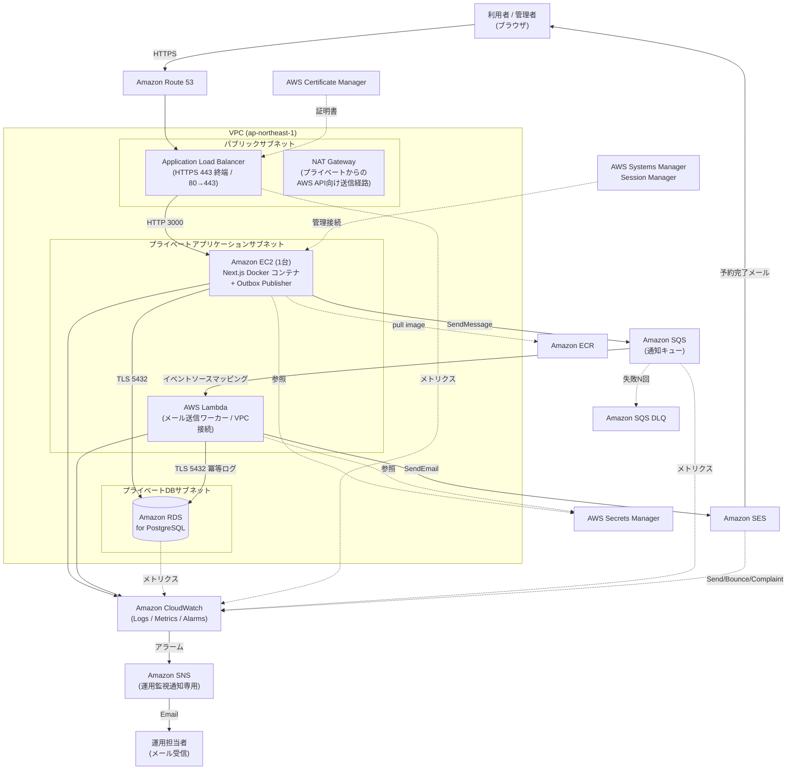
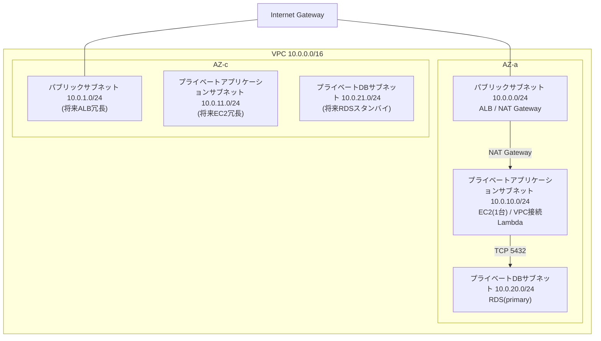
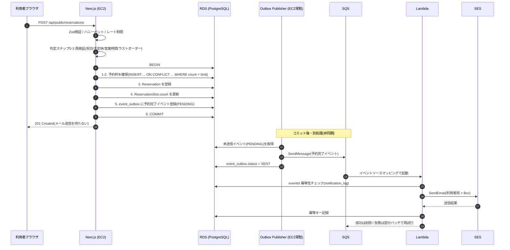
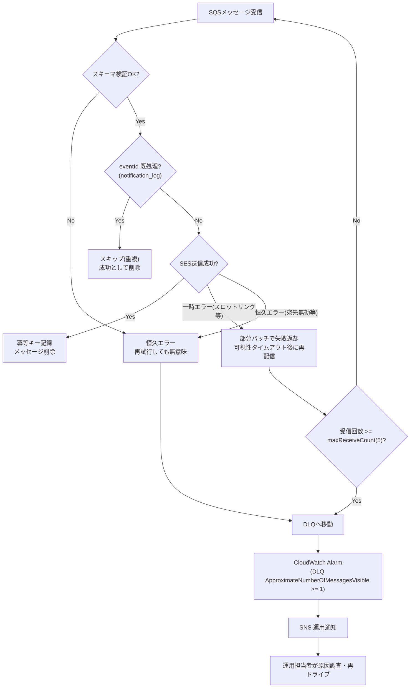
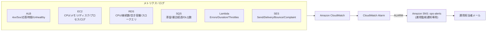
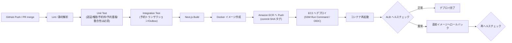
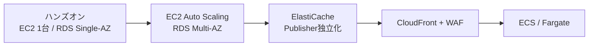

# 本番用AWSアーキテクチャ設計書

尾崎予約システム(Next.js フルスタック再構築版)のAWS本番環境アーキテクチャ設計。

構築担当者がAWS環境を構築・実装できる粒度で、ネットワーク・アプリケーション・非同期メール通知・運用監視・セキュリティ・CI/CDを整理する。本書はアーキテクチャと実装方針を中心に記述し、アプリケーションの実装コードは含まない。

---

## 1. 文書概要

### 1.1 目的と位置づけ

本書は、Angular + CakePHP から Next.js フルスタックへ再構築した予約システムを、Amazon Web Services(AWS)上で本番運用するためのアーキテクチャ設計をまとめたものである。

本書は**ハンズオン(学習・検証)を主目的**とするため、コストと構築難易度を抑え **EC2は1台構成** とする。冗長化・Auto Scaling・CloudFront・AWS WAF は今回の必須構成に含めず、**将来拡張(23章)** として整理する。ただし将来的な複数台化へ拡張できる設計とし、ハンズオン構成と本格運用構成を各章で明確に区別する。

### 1.2 基本アーキテクチャ

利用者リクエストの経路:

```
Amazon Route 53
  ↓
Application Load Balancer(パブリックサブネット)
  ↓
Amazon EC2 / Next.js(プライベートアプリケーションサブネット)
  ↓
Amazon RDS(プライベートDBサブネット)
```

予約完了メール通知の経路(非同期):

```
Next.js → Amazon SQS → AWS Lambda → Amazon SES → 予約者への予約完了メール
```

運用監視通知の経路:

```
Amazon CloudWatch Alarm → Amazon SNS → 運用担当者へのメール通知
```

**予約者へのトランザクションメールは Amazon SES のみで送信する。Amazon SNS は運用担当者への監視通知専用**であり、両者の役割を混同しない。

### 1.3 関連ドキュメント

| ドキュメント | 本書との関係 |
|---|---|
| `docs/requirements/current-requirements.md` | 業務要件・MVP範囲。本書のアプリケーション設計の前提。 |
| `docs/design/db-schema.md` | DB設計(Prisma + PostgreSQL)。本書10章の前提。 |
| `docs/design/api-design.md` | API設計。メール送信方式に本書との差分がある(1.4節)。 |
| `docs/design/data-migration.md` | 旧DB移行計画。本書のRDS初期データ投入の前提。 |
| `prisma/schema.prisma` | 実際のPrismaスキーマ。本書10章の基準。 |
| `docs/product/user-stories.md` | US-011(非同期メール化)/US-015(AWS構築)/US-016(監視・DLQ)が本書に対応。 |

### 1.4 既存設計との重要な差分(メール送信方式)

`docs/design/api-design.md` 7章では、予約確定のDBトランザクションをコミットした後、**Route Handler内から直接メール送信関数(nodemailer)を同期的に呼び出す**設計になっている。現行MVP実装(`mvp/feature/reservation-mvp` ブランチ)もこの同期方式に沿っている。

本書のAWS本番アーキテクチャでは、この予約完了メール通知を **`event_outbox` テーブル + Amazon SQS + AWS Lambda + Amazon SES による非同期方式**へ変更する。これは「MVPの同期送信」から「本番運用を見据えた非同期Outbox方式」への**意図的な段階的進化**であり、設計間の矛盾ではない。差分の詳細と移行方針は22章・24章に明記する。

なお `api-design.md` 7章・11章は、メール配信手段を「SMTP/Resend/SES等から選定(未決)」として開いたままにしており、本書がSES + 非同期を採用しても矛盾は生じない(選定の確定として位置づく)。

### 1.5 改訂履歴(旧版からの主な変更点)

本書は既存の同名ドキュメントを、Product Owner から提示された新仕様に基づき全面改訂したものである。旧版からの主な変更点は以下のとおり。

| 区分 | 旧版 | 本改訂版 |
|---|---|---|
| 採用AWSサービス | S3・CloudTrail・EventBridge Scheduler・DynamoDB 等を含む | **14サービスに絞り込み**。Amazon S3 / AWS CloudTrail / Amazon EventBridge Scheduler / Amazon DynamoDB を採用構成から除外(「過剰なAWSサービスを追加しない」方針)。GitHub Actions は非AWSのCI/CD補助として区別。 |
| Lambda冪等性ストア | Amazon DynamoDB(VPC外Lambda)を推奨 | **Amazon RDS(既存DB)ベースへ変更**。サービス数を14に抑えるため。Lambdaは**VPC接続**へ変更(13章)。 |
| サブネット命名 | 「プライベートサブネット(App)」等 | **「プライベートアプリケーションサブネット」「プライベートDBサブネット」に統一**(6章)。 |
| SNSの用途 | 運用通知 + SESバウンス/苦情通知にも言及 | **運用担当者への監視通知専用**に明確化。SESのバウンス/苦情はCloudWatch経由で監視し、SNSは利用者向けメールに使わない(15章)。 |
| バックアップ | S3(バージョニング)へログ/証跡を保管 | **RDS自動バックアップ・スナップショット・PITR・ECRライフサイクル**で構成。S3を復活させない(20章)。 |
| 監査証跡 | CloudTrailを採用 | 採用構成から除外し**24章「今後の検討事項」**へ移動。 |
| 章立て | 23章 | **24章に再編**(章番号・順序を新仕様に一致)。 |
| Mermaid図 | 5種類+α | **6種類**(全体構成 / VPC / シーケンス / DLQ / 監視 / CI/CD)。 |

---

## 2. システムの目的

### 2.1 業務上の目的

利用者(患者)がWeb上のカレンダーから、拠点(日向 / 延岡)ごとの空き状況を確認し、来店予約を登録できるようにする。予約確定時には利用者と運用担当者(Bcc)へ予約完了メールを自動送信する。管理者は管理画面から予約一覧の確認・キャンセル・営業設定・不定休・祝日を管理する。

### 2.2 技術上の目的(本書のスコープ)

- 予約登録処理の**データ整合性**(予約枠の重複確保防止)をDBトランザクションで担保する。
- メール通知を**非同期化**し、通知処理の遅延・失敗が予約登録のレスポンスやDBロック保持時間に影響しないようにする。
- 本番運用に必要な**セキュリティ・監視・ログ・バックアップ・CI/CD**を、指定の14 AWSマネージドサービスで構成する。
- ハンズオンとして**低コスト・低難易度**で構築でき、かつ本格運用へ**段階的に拡張**できる設計とする。

---

## 3. 前提条件

### 3.1 確定している前提

| 項目 | 値 | 根拠 |
|---|---|---|
| アプリケーション | Next.js(App Router)フルスタック | 再構築方針 |
| ORM | Prisma | `prisma/schema.prisma` |
| データベース | PostgreSQL(Amazon RDS for PostgreSQL) | `db-schema.md` |
| タイムゾーン | Asia/Tokyo(格納は `timestamptz`) | 要件4章、`data-migration.md` |
| 拠点 | 日向(HYUGA)/ 延岡(NOBEOKA)の2拠点 | 要件I章 |
| 認証 | 管理画面のみ(Auth.js Credentials + JWT)。公開予約APIは認証なし | `api-design.md` 6章 |
| メール通知 | 予約確定時に利用者宛 + Bcc(運用担当者)へ送信。**継続必須の業務要件** | 要件3-5 |
| デプロイ単位 | Dockerコンテナ(イメージは Amazon ECR 管理) | 本書のCI/CD前提 |
| リージョン | `ap-northeast-1`(東京)を想定 | 本書 |

### 3.2 ハンズオン構成の前提(制約)

- **EC2は1台構成**とする。EC2の障害・再起動・デプロイ時には**サービスが一時停止**する(22章で明記)。
- **RDSはSingle-AZ構成**から開始する(Multi-AZは23章の拡張候補)。
- **Amazon CloudFront・AWS WAF・EC2 Auto Scaling・RDS Multi-AZ・Amazon ElastiCache・Amazon ECS・AWS Fargate は必須構成に含めず**、将来拡張(23章)として整理する。
- 過剰なAWSサービスを追加しない。採用するのは5章の14サービスに限定する。

### 3.3 本書で確定しない事項(推測しない)

以下は他ドキュメントに確定情報がなく、本書では確定せず**24章「今後の検討事項」**に列挙する。

- 本番のドメイン名、Route 53 のホストゾーン、SESの送信元ドメイン。
- EC2のインスタンスタイプ、RDSのインスタンスクラス、ストレージサイズ、トラフィック見込み。
- メール配信手段の最終確定(本書はSESを採用する前提で設計。`api-design.md` 11章の未決事項3を確定する位置づけ)。

---

## 4. AWS全体構成

### 4.1 処理の流れ(概要)

1. 利用者はNext.jsの予約画面から空き状況を確認し、予約を登録する。リクエストは Route 53 → ALB → EC2 の経路をたどる。
2. Next.js は Amazon EC2 上でDockerコンテナとして動作し、予約情報を Amazon RDS(PostgreSQL)へ保存する。
3. 予約登録は**単一DBトランザクション**内で、予約枠の確保(排他制御)・空き再確認・予約登録・予約枠更新・`event_outbox` への予約完了イベント登録までを行いコミットする。**トランザクション内からSQS/SESを直接呼び出さない**(11章)。
4. コミット後、Outbox Publisher が未送信イベントを取得し、予約完了イベントを Amazon SQS へ送信する。
5. SQSをイベントソースに AWS Lambda が起動し、Amazon SES で予約完了メール(利用者宛 + Bcc)を送信する。
6. 規定回数失敗したメッセージは Dead Letter Queue(DLQ)へ移動する。
7. アプリ/Lambda/各サービスのログ・メトリクスは Amazon CloudWatch へ集約し、閾値超過時は CloudWatch Alarm → Amazon SNS で**運用担当者**へ通知する。

### 4.2 責務分担

| コンポーネント | 責務 |
|---|---|
| Next.js(EC2) | 予約画面、予約API、入力値検証、空き確認、予約登録、予約枠更新、Outboxイベント登録、SQSへのイベント発行(Outbox Publisher) |
| Amazon RDS | 予約データ・マスタデータ・`event_outbox`・通知冪等ログの永続化、トランザクション整合性 |
| Amazon SQS(+ DLQ) | 予約完了イベントの非同期バッファリング、再試行、恒久失敗の隔離 |
| AWS Lambda | SQSメッセージ検証、冪等性制御、SESでのメール送信、構造化ログ出力 |
| Amazon SES | 利用者への予約完了メール配信(SPF/DKIM/DMARC、バウンス/苦情管理) |
| Amazon CloudWatch | 全サービスのログ・メトリクス・アラーム |
| Amazon SNS | **運用担当者への監視通知専用** |

### 4.3 AWS全体構成図(Mermaid図1)



---

## 5. AWSサービス一覧

### 5.1 本書で採用するサービス(14個)

| # | サービス | 用途 | 採用理由 |
|---|---|---|---|
| 1 | Amazon Route 53 | DNS・ドメイン管理・ヘルスチェック | ACM/ALBとの統合が容易。 |
| 2 | AWS Certificate Manager (ACM) | TLS証明書の発行・自動更新 | ALBに無料で適用でき更新も自動。 |
| 3 | Application Load Balancer (ALB) | HTTPS終端、ヘルスチェック、将来の複数台分散 | EC2を非公開化しつつ公開する標準手段。 |
| 4 | Amazon EC2(1台) | Next.jsコンテナ実行環境 | ハンズオンの低コスト・低難易度を優先。 |
| 5 | Amazon RDS for PostgreSQL | 予約DB・Outbox・冪等ログ | 既存Prisma設計(PostgreSQL)と一致。 |
| 6 | Amazon SQS(標準キュー) | メール通知イベントのバッファ | 予約処理とメール送信を疎結合化。 |
| 7 | Amazon SQS Dead Letter Queue | 処理失敗メッセージの隔離 | 恒久エラーの可視化と再処理のため。 |
| 8 | AWS Lambda | メール送信ワーカー | SQSトリガーでサーバーレスに実行。 |
| 9 | Amazon SES | 利用者への予約完了メール配信 | SPF/DKIM/DMARC・バウンス管理が可能。 |
| 10 | Amazon SNS | **運用担当者への監視通知専用** | CloudWatch Alarm からの運用通知配信。 |
| 11 | Amazon CloudWatch | ログ・メトリクス・アラーム | 全サービスの監視を集約。 |
| 12 | AWS Secrets Manager | DB接続情報・SES/Bcc設定等の秘匿管理 | ソース/イメージへの秘密混入を防ぐ。 |
| 13 | AWS Systems Manager Session Manager | EC2への管理接続 | SSHポートを開けずに安全に接続。 |
| 14 | Amazon ECR | Dockerイメージレジストリ | CI/CDからのpush、EC2からのpull。 |

補足: **GitHub Actions** はCI/CDパイプライン(21章)で用いるが、これはAWSサービスではないため上記14には含めない。AWSリソースへはOIDC + AssumeRoleでキーレス接続する。

### 5.2 将来拡張(本書では採用しない)

以下は**23章の将来拡張**として扱い、本書のハンズオン構成では採用しない。

| サービス | 用途 | 位置づけ |
|---|---|---|
| Amazon CloudFront | CDN・静的配信高速化・エッジ保護 | 23章 |
| AWS WAF | L7ファイアウォール | 23章 |
| EC2 Auto Scaling | EC2複数台の自動増減 | 23章 |
| Amazon RDS Multi-AZ | DBの自動フェイルオーバー | 23章 |
| Amazon ElastiCache | レート制限カウンタ・セッション共有 | 23章 |
| Amazon ECS / AWS Fargate | コンテナオーケストレーション | 23章 |

---

## 6. ネットワーク設計

### 6.1 設計方針

- VPCを1つ作成する(`ap-northeast-1`)。
- サブネットを**3種類に論理分離**する。EC2とRDSを同じ「プライベートサブネット」と表現せず、明確に分ける。
  - **パブリックサブネット**: Application Load Balancer を配置。
  - **プライベートアプリケーションサブネット**: Amazon EC2 / Next.js アプリケーションを配置(冪等ログ参照のためLambdaもVPC接続でここに関連付ける、13章)。
  - **プライベートDBサブネット**: Amazon RDS を配置。
- 各サブネットは将来のMulti-AZ化を見据え**2つのAZにまたがって用意**する(ハンズオンでは実リソースは片方のAZに配置してよいが、サブネット自体は両AZに作る)。
- EC2には**パブリックIPを付与しない**。管理接続はSSHではなく AWS Systems Manager Session Manager を使用する。
- 通信経路は**最小権限**でセキュリティグループ(SG)により制御する(16章と連動)。

### 6.2 サブネット別の要件

**パブリックサブネット(配置: ALB)**
- インターネットからHTTPS(443)通信を受け付ける。
- HTTP(80)通信はHTTPSへリダイレクトする。
- EC2のセキュリティグループに対してのみ通信する(アプリポート)。

**プライベートアプリケーションサブネット(配置: EC2 / Next.js、VPC接続Lambda)**
- EC2にはパブリックIPを付与しない。インターネットからEC2へ直接アクセスできない。
- ALBからの通信のみ受け付ける。
- EC2への管理接続は AWS Systems Manager Session Manager を使用する。**SSHの22番ポートは公開しない**。
- プライベートからのAWS API向け送信(ECR pull、SQS、Secrets Manager、CloudWatch Logs、SES 等)は NAT Gateway 経由とする(6.4節)。

**プライベートDBサブネット(配置: RDS)**
- RDSのPublic Accessは無効にする。
- EC2(および冪等ログ参照のVPC接続Lambda)のセキュリティグループからの接続のみ許可する。
- インターネットから直接接続できない構成にする。

### 6.3 VPC・サブネット構成図(Mermaid図2)



### 6.4 セキュリティグループ設計(通信経路)

| SG | インバウンド許可 | アウトバウンド許可 |
|---|---|---|
| `sg-alb` | 0.0.0.0/0 から TCP 443(HTTPS)/ 80(HTTPSへリダイレクト用) | `sg-ec2` へ TCP 3000(アプリポート) |
| `sg-ec2` | `sg-alb` から TCP 3000 のみ | `sg-rds` へ 5432、NAT経由でAWS API向け 443 |
| `sg-lambda` | なし(Lambdaはインバウンド不要) | `sg-rds` へ 5432、NAT経由でSES/Secrets向け 443 |
| `sg-rds` | `sg-ec2` / `sg-lambda` から TCP 5432 のみ | なし(原則) |

- **ALBからEC2への通信のみ許可、EC2/LambdaからRDSへの通信のみ許可**。RDSはパブリックアクセス無効でインターネット非公開。
- SGはIP指定ではなく**SG参照(source security group)**で相互指定し、将来のスケール時も設定変更が最小になる構成にする。

### 6.5 プライベートサブネットからの外部通信(NAT Gateway)

EC2(プライベート)およびVPC接続Lambdaは、以下のAWS API呼び出しにインターネット向けの送信経路が必要になる。

- Amazon ECR からのイメージpull
- Amazon SQS API 呼び出し(EC2のOutbox Publisher)
- Amazon SES API 呼び出し(Lambda)
- AWS Secrets Manager 参照
- CloudWatch Logs 送信

本書のハンズオンでは、構築を単純化するため**パブリックサブネットにNAT Gatewayを1つ配置**し、プライベートサブネットからの上記送信をNAT経由で行う。SSM Session Manager 接続もNAT経由で到達できる(RDSはVPC内プライベート通信のみでNATを経由しない)。

> コスト注意: NAT Gatewayは時間課金 + データ処理課金が常時発生する。常時起動のハンズオンでは割高になりやすいため、検証しない時間帯はNAT Gatewayを削除/再作成する運用も選択肢とする。本番でセキュリティ境界とコストを最適化する場合は、VPCインターフェースエンドポイント構成への切り替えを検討する(この場合、Amazon ECR のイメージレイヤ取得のためにS3 Gatewayエンドポイントが内部的に必要になる点に留意。これはアプリ用途のオブジェクトストレージとしてのS3採用ではなく、ECRの内部依存に対する最小構成である)。この判断は24章の検討事項とする。

---

## 7. Route 53設計

- 本番ドメイン(未確定、3.3節)のパブリックホストゾーンを Route 53 に作成する。
- アプリのFQDN(例: `reserve.example.com`)を **ALBへのエイリアスAレコード**として登録する。
- ACM証明書のDNS検証用CNAMEレコードを登録する(8章)。
- SESのドメイン認証(DKIM CNAME、MAIL FROM のMX/TXT、SPF/DMARCのTXT)レコードを登録する(14章)。
- 必要に応じてRoute 53ヘルスチェックでALBエンドポイントを監視する(CloudWatch連携、18章)。

---

## 8. ALB設計

ALBは**パブリックサブネット**へ配置する。

| 役割 | 設計 |
|---|---|
| HTTPS受付・SSL終端 | 443リスナーでACM証明書を適用しSSL終端する。 |
| HTTP→HTTPSリダイレクト | 80リスナーは443へ301リダイレクトする。 |
| リクエスト転送 | ターゲットグループ(EC2:3000)へ転送する。 |
| ヘルスチェック | ターゲットグループのヘルスチェックに `/api/health`(DB接続可否を含む軽量チェック)を用いる。 |
| 将来の複数台分散 | EC2は1台構成だが、**将来EC2を複数台へ増やせるようALBを経由**する構成とする。Auto Scaling化時(23章)にターゲットを追加するだけで分散できる。 |

- EC2はプライベートアプリケーションサブネットにあり、ALB(`sg-alb`)からの 3000 番のみを受け付ける。

---

## 9. EC2・Next.js設計

### 9.1 実行環境

- EC2上でNext.js(App Router)のフルスタックアプリを**Dockerコンテナ**として実行する。DockerイメージはAmazon ECRで管理する。
- EC2はプライベートアプリケーションサブネットに配置し、パブリックIPを付与しない。管理接続はSSM Session Managerのみ。
- 環境変数(`DATABASE_URL`、SES/Bcc設定 等)はSecrets Managerから取得する(16章)。**イメージに秘密情報を焼き込まない**。
- ヘルスチェック用 `/api/health`(DB接続可否を含む)を用意し、ALBヘルスチェックに使う。

### 9.2 Next.jsが担当する処理

予約画面、予約API、入力値検証(Zod)、予約枠確認、予約登録、予約枠更新、予約完了イベントの生成(`event_outbox` 登録)、Amazon SQSへのメッセージ送信(Outbox Publisher)。API/判定/トランザクションの詳細は `api-design.md` に準拠し、本書はAWS上での実行方式とメール非同期化に関わる差分を規定する。

### 9.3 可用性の制約

**EC2は1台構成のため、EC2の障害・再起動・デプロイ時にはサービスが一時停止する。** これはハンズオン前提の割り切りであり、本番では23章のEC2複数台化 + Auto Scaling + ALB分散で解消する(20章・22章にも明記)。

### 9.4 Outbox Publisher(EC2常駐)

- Next.jsと同居するプロセス(または軽量スケジューラ)で、`event_outbox` の `status = PENDING` を `occurredAt` 昇順で一定件数取得し、各イベントを Amazon SQS へ `SendMessage` し、成功したら `status = SENT` に更新する。
- SQS送信に失敗したら `retryCount` を増やし `PENDING` のまま次回に委ねる。規定回数超過は `FAILED` にして監視対象とする。
- **SQSは少なくとも1回配信(at-least-once)** であり、Publisher側の二重送信もありうるが、重複はLambda側の冪等性制御(13章)で吸収する。
- EC2 1台構成のためPublisherも単一障害点だが、イベントはRDSに `PENDING` で残り**消失しない**(復旧後に送出、遅延のみ)。本番でEC2を独立/廃止する段階では、Publisherを独立実行基盤へ切り出すことを検討する(23章・24章。本書では新規AWSサービスを追加せずEC2常駐方式を採用する)。

---

## 10. RDS設計

### 10.1 保存データ

Amazon RDS には、予約情報・予約枠情報・利用者情報・メール通知状態(`event_outbox`)・通知冪等ログ(13章)を保存する。既存の `prisma/schema.prisma`(`Place` / `AdminUser` / `BusinessHour` / `PublicHoliday` / `Closure` / `ReservationSlot` / `Reservation`)をそのまま利用し、本書で追加するのは `event_outbox` と `notification_log`(冪等ログ)のみ。

### 10.2 RDS構成

| 項目 | ハンズオン | 本格運用 |
|---|---|---|
| エンジン | PostgreSQL(Prisma対応バージョン) | 同左 |
| 可用性 | **Single-AZ** | Multi-AZ(23章) |
| 配置 | プライベートDBサブネット、パブリックアクセス無効 | 同左 |
| 接続情報 | **AWS Secrets Manager** で管理 | Secrets Manager(自動ローテーション有効化) |
| 暗号化 | 保存時暗号化(KMS)有効、通信TLS必須 | 同左 |
| 自動バックアップ | 有効(保持期間例: 7〜14日) | 保持期間を要件に応じ延長 |
| Point-in-Time Recovery | 有効(保持期間内の任意時点へ復元) | 同左 |
| スナップショット | 重要変更前に手動スナップショット取得 | 定期取得を運用化 |

### 10.3 event_outbox テーブル(本書で追加)

Transactional Outbox パターンのため、Prismaスキーマに以下を追加する(実装はプロダクト化フェーズ)。

| カラム | 型 | 説明 |
|---|---|---|
| `id` | BigInt/autoincrement | 主キー |
| `eventId` | UUID(`@unique`) | イベント一意ID。SQSメッセージ・Lambda冪等キー |
| `eventType` | String | 例 `RESERVATION_CONFIRMED` |
| `aggregateType` / `aggregateId` | String / Int | 例 `Reservation` / `reservationId` |
| `payload` | Jsonb | SQSへ送るメッセージ本体(12章のスキーマ) |
| `status` | Enum(`PENDING`/`SENT`/`FAILED`) | 発行状態 |
| `retryCount` | Int | Publisher側の送信試行回数 |
| `occurredAt` / `sentAt` | Timestamptz | 発生時刻 / SQS送信成功時刻 |
| `createdAt` / `updatedAt` | Timestamptz | 監査用 |

- インデックス `@@index([status, occurredAt])`(未送信取得の効率化)。
- `payload` は12章のSQSメッセージ最小項目に限定し、**個人情報は必要最小限**とする。

### 10.4 接続・コネクション管理

- EC2上のNext.jsからRDSへはプライベートサブネット内でTLS接続する。
- 単一EC2 + PrismaのコネクションプールでMVP規模は十分。VPC接続Lambda(13章)はコネクション消費に注意し、Reserved Concurrencyで同時実行を抑える。将来複数台化・サーバーレス化する場合は RDS Proxy 導入を検討する(23章)。
- `CHECK (count >= 0)`(`db-schema.md` 推奨)をマイグレーションSQLで追加する。

### 10.5 初期データ・移行

- `Place`(HYUGA/NOBEOKA)、`AdminUser` 初期管理者をシード投入する。
- 旧本番データ移行は `data-migration.md` に従い、ステージングでリハーサル後に本番実行する。移行はSSM経由の踏み台/EC2上実行でプライベート経路からRDSへ接続する。

---

## 11. 予約登録処理

### 11.1 単一トランザクションの必須要件

予約確定処理は、**単一DBトランザクション内**で以下を実行する(ユーザー指定の6ステップ)。

```
BEGIN
  1. 対象予約枠をロック(= 排他制御。悲観ロックではなくアトミック条件更新で実現、11.2)
  2. 空き枠を再確認(上限未満のときだけ確保できる条件付き更新)
  3. 予約情報(Reservation)を登録
  4. 予約枠(ReservationSlot.count)を更新
  5. event_outbox に予約完了通知イベントを登録(status = PENDING)
  6. COMMIT
```

- 予約確定時の空き枠確認は、**画面表示時の情報を信用せず、トランザクション内でDBの現在値を用いて再確認**する。祝日・不定休・営業時間の再検証はトランザクション開始前の通常SELECTで行い、衝突可能性が最も高い予約枠の`count`はトランザクション内でアトミックに排他制御する(`api-design.md` 4章に準拠)。
- **トランザクション内からSQSやSESを直接呼び出してはならない**。外部API呼び出しはトランザクション時間を伸ばしロック保持を悪化させ、「コミット前に送信 → ロールバックで予約が消えたのにメールが飛ぶ」不整合を生む。トランザクション内ではRDSへのイベント記録(Outbox)のみを行い、SQS送信はコミット後にPublisherが行う(9.4節)。

### 11.2 排他制御(RDS側のアトミック条件更新)

ステップ1「対象予約枠をロック」・ステップ2「空き枠を再確認」・ステップ4「予約枠を更新」は、**単一のアトミックSQLで不可分に実現**する。これは既存設計(`api-design.md` 4.3節 / `db-schema.md`。`ReservationSlot.fix` フラグは廃止し `count` と `BusinessHour.reservationLimit` の比較で都度判定)を踏襲したものである。

```sql
INSERT INTO reservation_slots (place_id, start_at, count, created_at, updated_at)
VALUES (:placeId, :subSlotStart, 1, now(), now())
ON CONFLICT (place_id, start_at)
DO UPDATE SET count = reservation_slots.count + 1, updated_at = now()
WHERE reservation_slots.count < :reservationLimit
```

- `ON CONFLICT ... DO UPDATE` の際に取得される**行ロックが「対象予約枠をロック」**に相当し、`WHERE count < :limit` が**「空き枠の再確認」**に相当する。チェックと更新を2ステップに分けないことで、複数リクエストによる予約枠超過を構造的に防止する。影響行数が0なら `SLOT_UNAVAILABLE` としてトランザクション全体をロールバックする。
- これはデフォルトのREAD COMMITTEDで安全に機能し、`SELECT ... FOR UPDATE` の悲観ロックやSERIALIZABLEのリトライは不要である。ユーザー指定の「対象予約枠をロック」「RDS側の排他制御」は、この**アトミック条件更新方式で満たす**(悲観ロックへの変更を意味しない)。
- 90分予約は連続3枠を占有する。デッドロック回避のため、**予約確定・キャンセルとも対象スロットを `startAt` 昇順で処理する**(`api-design.md` 4.4節)。途中の枠が満枠ならトランザクション全体がロールバックし、部分的な枠確保は残らない。

### 11.3 予約登録からメール送信までのシーケンス図(Mermaid図3)



---

## 12. SQS設計

### 12.1 キュー構成

予約完了メール通知は Amazon SQS を経由して非同期処理する。

| 項目 | 設定方針 |
|---|---|
| キュー種別 | **標準キュー(Standard Queue)**。順序保証不要・スループット優先。重複はLambdaの冪等性で吸収 |
| メインキュー | `reservation-notification-queue` |
| DLQ | `reservation-notification-dlq` |
| Redrive Policy | `maxReceiveCount = 5`(5回受信で失敗ならDLQへ移動) |
| Visibility Timeout | Lambdaタイムアウトの**6倍以上**を目安(例: Lambda 30秒 → 可視性 180秒) |
| Message Retention Period | メインキュー例: 4日 / DLQ例: 14日(調査猶予を確保) |
| 暗号化 | サーバーサイド暗号化(SSE-SQS または SSE-KMS)を有効化 |
| Lambdaバッチサイズ | 小さめ(例: 5〜10)から開始 |
| 部分バッチレスポンス | `ReportBatchItemFailures` を有効化し、失敗メッセージのみ再試行 |
| メッセージ再試行 | 一時エラーは可視性タイムアウト後に再配信、`maxReceiveCount` 超過でDLQへ |

FIFOキューは厳密な順序・重複排除が必要な場合の選択肢だが、本ユースケースは順序不要かつ冪等性をアプリ側で担保するため、スループットとコストで有利な標準キューを採用する。

### 12.2 SQSメッセージ設計

最低限、以下を含める(個人情報は必要最小限)。

| 項目 | 説明 |
|---|---|
| `version` | メッセージスキーマのバージョン(例 `"1.0"`) |
| `eventId` | イベント一意ID(UUID)。冪等キー |
| `eventType` | 例 `RESERVATION_CONFIRMED` |
| `occurredAt` | イベント発生時刻(ISO 8601, JST) |
| `reservationId` | 予約ID |
| `recipientEmail` | 送信先メールアドレス |
| `recipientName` | 宛名(本文差し込み用) |
| `templateName` | メールテンプレート名(例 `reservation-confirmation-ja`) |

住所・電話番号など送信に不要な個人情報は含めない。本文生成に必要な予約日時・拠点名等は `payload` に最小限含めるか、Lambdaが `reservationId` でRDSを参照して取得する(ハンズオンでは `payload` に最小限同梱する方が容易)。

### 12.3 メッセージJSON例

```json
{
  "version": "1.0",
  "eventId": "6f0d5b2e-6b1a-4a3d-9f2b-7d0a1c2e3f4a",
  "eventType": "RESERVATION_CONFIRMED",
  "occurredAt": "2026-07-15T10:30:00+09:00",
  "reservationId": 12345,
  "recipientEmail": "user@example.com",
  "recipientName": "尾崎 太郎",
  "templateName": "reservation-confirmation-ja",
  "payload": {
    "placeName": "日向",
    "startAt": "2026-07-20T09:00:00+09:00",
    "endAt": "2026-07-20T10:30:00+09:00",
    "typeLabel": "はじめて / 未来店"
  }
}
```

### 12.4 SQS再試行・DLQ処理図(Mermaid図4)



---

## 13. Lambda設計

### 13.1 責務

SQSをイベントソースとするメール送信ワーカー。以下を実装する。

1. **SQSメッセージの受信**(イベントソースマッピング)。
2. **スキーマ検証**: 必須項目・型を検証。不正なら恒久エラー(再試行しても直らない)。
3. **eventIdによる冪等性制御**: 既処理ならSES送信をスキップして成功扱い。**同じメッセージが複数回配信されてもメールを重複送信しない**。
4. **メール本文の生成**: `templateName` + `payload` からHTML/テキスト本文を生成。
5. **Amazon SESへの送信依頼**: `recipientEmail` 宛 + Bcc(運用担当者)。
6. **構造化ログ出力**: 19章のフォーマットでCloudWatch Logsへ。**個人情報・メール本文は出力しない**。
7. **一時エラー/恒久エラーの分類**: 一時エラー(SESスロットリング、一時的ネットワーク、`ServiceUnavailable`)は再試行、恒久エラー(スキーマ不正、無効アドレス、`MessageRejected`)は再試行せずDLQへ。
8. **部分バッチレスポンス**: `ReportBatchItemFailures` を有効化し、`batchItemFailures` に失敗分のみ返す。
9. **再試行制御**: 一時エラーは可視性タイムアウト後に再配信、`maxReceiveCount` 超過でDLQへ。

### 13.2 冪等性管理(RDSベース)

**冪等性ストアは Amazon RDS(既存DB)を使用する。** 予約DBに `notification_log`(`eventId` に一意制約)を設け、送信前に「未処理なら記録」を条件付きINSERTし、一意制約違反なら既処理と判定してSES送信をスキップする。

| カラム | 型 | 説明 |
|---|---|---|
| `eventId` | UUID(`@unique`/PK) | 冪等キー |
| `reservationId` | Int | 突合用 |
| `sentAt` | Timestamptz | SES送信成功時刻 |
| `status` | Enum(`SENT`/`FAILED`) | 送信結果 |
| `createdAt` | Timestamptz | 監査用 |

- **採用理由**: 指定の14サービスに冪等ストアを追加せず、既存RDSに集約できる。予約と通知を同一DBで突合でき監査もしやすい。
- **トレードオフ**: LambdaをRDSへ接続するため**VPC接続(プライベートアプリケーションサブネット)**が必要になり、`sg-lambda` からRDSへ5432を許可する(6.4節)。SES送信はNAT経由の外部通信となる。VPC接続によりENI・コネクション消費・コールドスタートに影響するため、Reserved ConcurrencyでLambda同時実行を抑え、RDSコネクションを保護する。
- Amazon DynamoDB を冪等ストアに用いればLambdaをVPC外に置けるが、**15個目のAWSサービス追加**となるため本書では採用しない。運用の単純化を優先する場合の代替として24章に記載する。

### 13.3 Lambda構成パラメータ

| 項目 | 方針 |
|---|---|
| ランタイム | Node.js(アプリと言語を揃える)。配布はzipまたはECRコンテナイメージ |
| VPC | **VPC接続**(プライベートアプリケーションサブネット、`sg-lambda`)。RDS冪等ログへ接続 |
| タイムアウト | 例: 30秒(SES呼び出し + リトライ余裕) |
| 同時実行 | Reserved Concurrency でSES送信レートとRDSコネクションを保護 |
| バッチサイズ | 小さめ(例: 5〜10)、`ReportBatchItemFailures` 有効 |
| 環境変数/秘密 | SES設定・Bcc宛先・DB接続はSecrets Manager。ソースに埋め込まない |

---

## 14. SES設計

予約者への**予約完了メールは Amazon SES で送信**する。Amazon SNS を予約者向けメール本文の送信に使用しない(SNSは15章の運用通知専用)。

### 14.1 送信ドメイン認証(SPF / DKIM / DMARC)

- 送信元ドメインをSESで検証(ドメイン認証)し、**DKIM(Easy DKIM)**を有効化。Route 53にCNAME/TXTを登録する。
- **SPF**: カスタムMAIL FROMドメインを設定しSPFアライメントを取る。
- **DMARC**: まず `p=none`(監視)から開始し、到達状況を見て `quarantine` → `reject` へ段階的に強化する(24章)。

### 14.2 Sandbox解除・Fromアドレス

- SESは初期状態が**Sandbox**(検証済みアドレスのみ・送信量制限あり)。本番前に**Sandbox解除(送信制限緩和)申請**を行う。申請にはユースケースとバウンス/苦情対応方針の記載が必要。
- 解除完了までは検証済みの利用者/Bccアドレスで動作確認する。
- **Fromアドレス**は認証済みドメインのアドレスを用い、環境変数/Secrets Managerで管理する。

### 14.3 HTMLメール・テキストメール・テンプレート管理

- HTMLメールとテキストメールの両方(マルチパート)を送信する。
- メールテンプレートは `templateName` で識別し、SESテンプレートまたはLambda内テンプレートで管理する。本文には要件C章の記載項目(店舗名、予約日時、氏名、カナ、電話番号、メールアドレス、両店舗電話番号、キャンセル時の電話連絡案内)を含める。

### 14.4 バウンス・苦情・送信失敗

- バウンス(Bounce)・苦情(Complaint)・配信(Delivery)・送信(Send)イベントを**SES Event Destination → CloudWatch**で受信・可視化する(SNSは運用通知専用のため、SES通知の一次受けには用いず、閾値超過時にCloudWatch Alarm → SNSで運用担当者へ通知する。18章)。
- ハードバウンス/苦情のアドレスは**送信抑制リスト(Suppression List)**で管理し再送しない。苦情率・バウンス率がSESの閾値を超えるとアカウントが停止されうるため監視必須(18章)。
- 送信失敗時: 一時エラーはSQS再試行、恒久エラーはDLQ隔離(12章・13章)。

### 14.5 Bcc(業務要件)

- 予約完了メールには運用担当者宛のBcc(要件3-5)を継続付与する。**ハードコードせず**、Secrets Manager / 環境変数(`MAIL_BCC` 相当)で管理する(現行MVPの `.env` でも環境変数化済み)。

---

## 15. SNS設計

Amazon SNS は、**予約者への予約完了メールではなく、運用担当者への監視通知に使用する**。利用者向けトランザクションメールはSES(14章)で送信し、SNSと役割を混同しない。

### 15.1 通知フロー

```
CloudWatch Alarm → Amazon SNS Topic(例: ops-alerts) → 運用担当者のメールアドレス
```

- SNSトピック `ops-alerts` を作成し、運用担当者のメールアドレスをサブスクライブする。
- 各CloudWatch Alarm(18章)のアクションをこのSNSトピックに向ける。

### 15.2 通知対象

| 分類 | 通知契機 |
|---|---|
| EC2 | EC2停止 / Next.jsプロセス停止 |
| ALB | ヘルスチェック異常(UnHealthyHostCount) |
| RDS | RDS異常(CPU・接続数・空きストレージ・バックアップ失敗) |
| Lambda | Lambdaエラー / Lambdaスロットリング |
| SQS | メッセージ滞留 / **DLQへのメッセージ移動** |
| SES | バウンス率上昇 / 苦情率上昇 |

---

## 16. セキュリティ設計

| 要件 | 設計 |
|---|---|
| HTTPS通信 | ALBで443終端、80は443へリダイレクト。ACM証明書を適用 |
| ACMによる証明書管理 | ACMで発行・自動更新、Route 53でDNS検証 |
| EC2の非公開化 | プライベートアプリケーションサブネット、パブリックIPなし、ALBからのみ受信 |
| RDSの非公開化 | プライベートDBサブネット、パブリックアクセス無効、`sg-rds` は `sg-ec2`/`sg-lambda` からの5432のみ |
| セキュリティグループによる通信制御 | SG参照で最小権限(6.4節) |
| IAMロールによる最小権限 | 各コンポーネント専用ロール(17章) |
| Secrets Managerによる秘密情報管理 | DB接続情報・SES/Bcc設定を管理。EC2/LambdaはIAMロールで取得。**ソース/イメージに秘密を含めない** |
| SQSの暗号化 | SSE-SQS または SSE-KMS を有効化 |
| RDSの暗号化 | 保存時暗号化(KMS)+ 通信TLS |
| CloudWatch Logsへの個人情報出力禁止 | 個人情報・Cookie・トークン・メール本文を出力しない(19章のマスキング方針) |
| EC2へのSSH公開禁止 | SSHインバウンドを開けない。22番ポート非公開 |
| Session Managerによる管理接続 | EC2管理はSSM Session Managerのみ |

補足: 公開予約API(認証なし)は `api-design.md` 8章のハニーポット・レート制限・Origin/Refererチェックで多層防御する。レート制限カウンタは複数インスタンス化を見据え外部ストア(将来ElastiCache等、US-012)を前提とする。

---

## 17. IAM設計

### 17.1 方針

- **人間の長期認証情報を発行しない**。EC2/Lambdaはロール(インスタンスプロファイル/実行ロール)で権限を得る。
- 各ロールは**必要なリソースARN・アクションに限定**する。CI/CDは**GitHub OIDC + AssumeRole**でキーレス運用する。

### 17.2 主なロールとポリシー(最小権限)

| ロール | 付与するアクション(例) | 対象リソース |
|---|---|---|
| EC2インスタンスロール | `sqs:SendMessage`、`secretsmanager:GetSecretValue`、`logs:CreateLogStream`/`PutLogEvents`、`ssm`関連(Session Manager)、`ecr:GetDownloadUrlForLayer`/`BatchGetImage`/`GetAuthorizationToken` | 対象SQSキュー / 特定Secret / 対象ロググループ / 対象ECRリポジトリ |
| Lambda実行ロール | `sqs:ReceiveMessage`/`DeleteMessage`/`GetQueueAttributes`、`ses:SendEmail`/`SendTemplatedEmail`、`secretsmanager:GetSecretValue`、`logs:*`(自ロググループ)、VPC接続用 `ec2:CreateNetworkInterface` 等 | 対象キュー / SES(送信元ID条件) / 特定Secret / 対象ロググループ |
| GitHub Actions用ロール(OIDC) | `ecr:*`(push関連)、`ssm:SendCommand`(SSM Run Commandデプロイ) | 対象ECRリポジトリ / 対象EC2(タグ条件) |

- SNS発行はCloudWatch Alarmのサービスプリンシパルに限定する。
- Lambdaの冪等ログはRDSへの接続(SG + Secrets)で実現し、DB権限はDBユーザー側で最小化する。
- KMSキーポリシーは各サービスの暗号化・復号に必要な範囲に限定する。

---

## 18. CloudWatch監視設計

### 18.1 集約するログ・メトリクスとアラーム条件例

| 対象 | メトリクス | アラーム条件例 |
|---|---|---|
| ALB | `HTTPCode_ELB_4XX_Count` / `HTTPCode_ELB_5XX_Count` / `HTTPCode_Target_5XX_Count` / `TargetResponseTime` / `UnHealthyHostCount` | Target5xxが閾値超過、応答時間p95超過、UnHealthyHost >= 1 |
| EC2 | CPU使用率 / メモリ使用率 / ディスク使用率(CloudWatch Agent) / Next.jsプロセス状態 / アプリケーションログ | CPU > 80%持続、ディスク > 85%、プロセス停止、ERRORログ急増 |
| RDS | CPU使用率 / DB接続数(`DatabaseConnections`) / 空きストレージ(`FreeStorageSpace`) / スロークエリ / バックアップ状態 | 接続数が上限接近、空きストレージ < 閾値、バックアップ失敗 |
| SQS | メッセージ滞留数(`ApproximateNumberOfMessagesVisible`) / 最古メッセージ経過時間(`ApproximateAgeOfOldestMessage`) / DLQメッセージ数 | 滞留継続増加、最古が閾値秒超過、**DLQ >= 1** |
| Lambda | `Errors` / `Duration` / `Throttles` / `ConcurrentExecutions` | Errors発生、Durationがタイムアウト接近、Throttles発生 |
| SES | `Send` / `Delivery` / `Bounce` / `Complaint` | バウンス率・苦情率が閾値超過(アカウント停止リスク) |

### 18.2 通知フロー(CloudWatch → SNS)

各CloudWatch AlarmはAmazon SNSトピック `ops-alerts`(15章)へ通知し、運用担当者のメールへ配信する。最重要アラーム: **DLQ >= 1**(メール未達の兆候)、SES苦情/バウンス率超過(アカウント停止リスク)、EC2/プロセス停止(サービス断)。

### 18.3 CloudWatch・SNS監視通知図(Mermaid図5)



---

## 19. ログ設計

### 19.1 方針

- Next.js / Lambda ともに **JSON構造化ログ**をCloudWatch Logsへ出力する。
- **個人情報・Cookie・認証トークン・メール本文は出力しない**。メールアドレスはドメイン部のみ/ハッシュ化、宛名・電話番号は出力しない。予約は `reservationId`、通知は `eventId` で追跡する。

### 19.2 最低限のフィールド

`timestamp` / `level` / `service` / `environment` / `requestId` / `reservationId` / `eventId` / `eventType` / `message` / `errorCode`

### 19.3 出力例

Next.js(予約登録成功):

```json
{
  "timestamp": "2026-07-15T10:30:00.123+09:00",
  "level": "INFO",
  "service": "reservation-web",
  "environment": "production",
  "requestId": "b1c2d3e4-...",
  "reservationId": 12345,
  "eventId": "6f0d5b2e-...",
  "eventType": "RESERVATION_CONFIRMED",
  "message": "reservation created and outbox event enqueued",
  "errorCode": null
}
```

Lambda(SES一時エラーで再試行):

```json
{
  "timestamp": "2026-07-15T10:30:05.456+09:00",
  "level": "WARN",
  "service": "reservation-mailer",
  "environment": "production",
  "requestId": "aws-request-id-...",
  "reservationId": 12345,
  "eventId": "6f0d5b2e-...",
  "eventType": "RESERVATION_CONFIRMED",
  "message": "SES throttling, will retry via SQS",
  "errorCode": "SES_THROTTLING"
}
```

### 19.4 保管

- ロググループごとに保持期間を設定(例: 30〜90日)。本書ではS3への長期エクスポートは行わず、必要になった時点で24章の検討事項として扱う(S3を安易に追加しない)。

---

## 20. バックアップ・障害復旧

### 20.1 バックアップ

| 対象 | 方式 |
|---|---|
| RDS | **自動バックアップ有効(保持期間例: 7〜14日)、Point-in-Time Recovery(PITR)有効、重要変更前に手動スナップショット取得**。バックアップはAWS管理領域に保持され、別途S3バケットを用意しない |
| Secrets Manager | バージョニングされ、ローテーション履歴を保持 |
| ECRイメージ | 直近数世代を保持(ロールバック用)。ライフサイクルポリシーで古いイメージを整理 |

### 20.2 障害復旧手順

| 障害 | 復旧手順 | サービス影響 |
|---|---|---|
| **EC2障害** | 1台構成のため、インスタンス再起動または新規起動 → ECRから同一/直前イメージをpullして起動 → ALBヘルスチェック復帰 | **一時的なサービス停止(予約受付不可)が発生する** |
| RDS障害 | Single-AZのため自動復旧待ち or スナップショット/PITRから復元。復元中は書き込み不可。本番はMulti-AZで自動フェイルオーバー(23章) | 書き込み断(復元時間分) |
| SQS滞留 | Lambda障害を修正・デプロイ。滞留は保持期間内で解消。Outboxは `PENDING` で残り消失しない | メール遅延 |
| DLQ発生 | アラーム受信 → メッセージ内容確認 → 原因特定 → 修正後にDLQからメインキューへ**再ドライブ(Redrive)**。恒久エラー対象は除外 | メール遅延・一部未達 |
| SES送信障害 | スロットリングは同時実行制御で緩和。苦情率超過はSuppression List + 原因対応。恒久不達はSuppression Listで管理 | 一部メール未達 |
| アプリ不具合 | CI/CDで直前イメージへロールバック(21章) | ロールバック時間分 |

> **重要(可用性リスク)**: 本ハンズオン構成は**EC2 1台・RDS Single-AZ**のため、EC2の障害・再起動・デプロイ時に**一時的なサービス停止**が発生する。可用性を高めるには23章のEC2複数台化 + Auto Scaling + ALB分散 + RDS Multi-AZが必要。

### 20.3 設計上の担保(メール消失防止)

Outboxパターンにより、SQS/Lambda/SESのいずれが一時停止しても、イベントはRDSに `PENDING` で残り復旧後に送出される。予約データ自体はトランザクションで確定するため、**管理画面の予約一覧が常に正**となる(`api-design.md` 7.2節の思想を非同期構成でも維持)。

---

## 21. CI/CD設計

### 21.1 パイプライン(Mermaid図6)



- テストは、Architectのブランチ運用方針に従い**認証・権限・金額計算・在庫/予約枠計算・予約重複・データ整合性**を必須テスト対象とする。失敗した場合はデプロイしない(architect.md マージ条件)。
- イメージタグはcommit SHA等の不変タグを使い、ロールバック先(直前SHA)を明確にする。
- Lambda(メール送信ワーカー)も同パイプラインでビルド・デプロイ(zip/イメージ更新)する。

### 21.2 EC2へのデプロイ方式

- **ハンズオン採用: AWS Systems Manager Run Command**。GitHub Actions(OIDC)→ `ssm:SendCommand` でEC2上のpull & restartスクリプトを実行する。**SSHポート/鍵不要**でSSH非公開のセキュリティ要件を満たし、追加サービスなしでプライベートEC2へ到達できる。GitHub OIDCでキーレス。
- SSH経由のデプロイは、SSH非公開要件に反するため**採用しない**。
- 本番でEC2複数台化・Blue/Greenデプロイ・自動ロールバックが必要になった段階では、AWS CodeDeployへの移行を検討する(23章)。CodeDeployはハンズオンの必須14サービスには含めない。

> 補足(CI/CDでの成果物保管): 本パイプラインはビルド成果物をDockerイメージとしてECRで管理し、**別途S3の成果物バケットを設けない**。将来的にビルドキャッシュや長期成果物保管が必要になった場合のみ、追加理由を明記のうえS3導入を検討する(24章。安易にS3を復活させない)。

---

## 22. ハンズオン構成の制約

| 項目 | ハンズオン設定 | 制約・リスク |
|---|---|---|
| EC2 | **1台**、小さめのインスタンス、プライベート、SSM接続 | **障害/再起動/デプロイ時にサービス一時停止** |
| RDS | **Single-AZ**、小さめクラス、自動バックアップ + PITR | 障害時に書き込み断 |
| Outbox Publisher | EC2常駐(追加リソースなし) | EC2停止中はメール発行停止(イベントは消失せず遅延のみ) |
| Lambda冪等性 | **RDS(`notification_log`)、VPC接続Lambda** | VPC接続でコネクション/コールドスタートに影響。Reserved Concurrencyで抑制 |
| SQS | 標準キュー + DLQ、SSE有効 | 順序保証なし(冪等性で吸収) |
| SES | 最初はSandboxで検証済みアドレス相手に確認 → 解除申請 | 解除前は送信先限定。苦情/バウンス率でアカウント制限リスク |
| ネットワーク | NAT Gateway経由でAWS API送信 | NATの時間課金。未使用時は削除/再作成を検討 |
| CloudFront / WAF / ElastiCache / Multi-AZ / Auto Scaling / ECS / Fargate | **導入しない** | 23章の拡張候補 |
| レート制限 | 単一プロセス内カウンタで暫定 | 本番の複数台化には外部ストアが必要(US-012) |
| 監査証跡(CloudTrail) | 本構成では未導入 | 監査要件が生じたら24章で検討 |

このハンズオン構成でも、**Outbox → SQS → Lambda → SES の非同期メール経路**と**セキュリティ境界(プライベートEC2/RDS、Secrets、SSM)**、**CloudWatch → SNS の運用監視**という本番の要点は体験できる。

---

## 23. 将来拡張

ハンズオン構成から本格運用へ、以下を段階的に追加する(いずれも5.2節の将来拡張サービス)。

1. **可用性の底上げ(最優先)**: **EC2 Auto Scaling** でEC2を複数台化しALBで分散。**Amazon RDS Multi-AZ** で自動フェイルオーバー。→ EC2/RDS単一障害点を解消。
2. **状態の外部化**: レート制限カウンタ・(必要なら)セッションを **Amazon ElastiCache** に集約。Outbox Publisherを独立実行基盤へ切り出し単一障害点を排除。
3. **エッジ・保護**: **Amazon CloudFront**(静的配信高速化・エッジキャッシュ)+ **AWS WAF**(L7防御、公開APIの濫用対策強化)を前段に追加。
4. **コンテナ基盤移行**: EC2運用から **Amazon ECS / AWS Fargate** へ移行し、インスタンス管理を廃してスケールを自動化。



---

## 24. 今後の検討事項

以下は他ドキュメントに確定情報がなく、本書では**推測で確定しない**。実装・構築フェーズで確定する。

1. **本番ドメイン名 / Route 53 ホストゾーン / SES送信元ドメイン**。
2. **EC2インスタンスタイプ、RDSインスタンスクラス・ストレージサイズ、トラフィック見込み**(実測に基づくサイジング。SQSバッチサイズ・Lambda同時実行・SES送信レートの調整根拠)。
3. **メール配信手段の最終確定**: 本書はSESを前提に設計した(`api-design.md` 11章の未決事項3を確定する位置づけ)。
4. **`api-design.md` の改訂**: 7章の同期メール送信を本書の非同期Outbox方式へ更新し、`event_outbox` / `notification_log` を `prisma/schema.prisma` に追加する(22章)。ドキュメント整合をプロダクト化フェーズで取る。
5. **Lambda冪等ストアの最終方式**: 本書はRDS(`notification_log`)を採用した。運用単純化のためVPC外Lambdaにしたい場合はDynamoDB採用(15個目のサービス追加)を再検討する余地がある。サービス数最小化とのトレードオフで判断する。
6. **Outbox Publisher の本番構成**: EC2常駐方式の単一障害点をどの段階で解消するか(独立実行基盤への切り出し)。追加AWSサービスの要否を含め判断する。
7. **NAT Gateway とVPCエンドポイントの選択**(6.5節): 常時起動・外部通信要否・コスト許容度で決定。VPCエンドポイント採用時のECR/S3 Gatewayエンドポイント依存を含め判断する。
8. **SESのDMARCポリシー強化スケジュール**(`p=none` → `quarantine` → `reject`)。
9. **監査証跡(AWS CloudTrail)の導入要否**: 本書のハンズオン14サービスには含めない。監査・コンプライアンス要件が生じた場合に導入を検討する。
10. **ログ長期保管(S3エクスポート)の要否**: 本書はCloudWatch Logs保持期間で完結させ、S3を安易に追加しない。長期保管要件が生じた場合に検討する。
11. **AdminRole(ADMIN/AUTHOR)の権限差**(`api-design.md` 5.6節・11章、US-013)。本書のIAM/認可設計とは別レイヤ。
12. **秘密情報ローテーションの運用**(Secrets Manager自動ローテーションの適用範囲・頻度)。
13. **Publisherポーリング間隔の許容遅延**(同期方式は即時試行、非同期方式は数秒〜数十秒遅延)の業務合意(22章)。

---

## 付録: 構築チェックリスト

### A. AWS環境構築

- [ ] VPC・3種サブネット(パブリック / プライベートアプリケーション / プライベートDB)を2AZに作成した
- [ ] Internet Gateway・NAT Gateway・ルートテーブルを設定した
- [ ] セキュリティグループ(sg-alb / sg-ec2 / sg-lambda / sg-rds)をSG参照で最小権限に設定した
- [ ] Route 53 ホストゾーン・ALBエイリアスレコードを作成した
- [ ] ACMで証明書を発行しALBに適用した(443終端、80→443リダイレクト)
- [ ] ALBターゲットグループのヘルスチェック(/api/health)を設定した
- [ ] EC2(パブリックIPなし、SSMエージェント有効、Docker導入)を起動した
- [ ] RDS for PostgreSQL(Single-AZ、パブリックアクセス無効、暗号化、自動バックアップ、PITR)を作成した
- [ ] SQSメインキュー + DLQ(Redrive maxReceiveCount=5、SSE、可視性タイムアウト)を作成した
- [ ] Lambda(VPC接続、SQSイベントソースマッピング、ReportBatchItemFailures、Reserved Concurrency)を作成した
- [ ] SESドメイン検証・DKIM・SPF・DMARC・MAIL FROMを設定した / Sandbox解除を申請した
- [ ] Secrets Manager にDB接続情報・SES/Bcc設定を登録した
- [ ] CloudWatch ロググループ・メトリクスフィルタ・アラームを作成し、SNSトピック(ops-alerts)へ接続した
- [ ] ECRリポジトリ(アプリ/Lambda)を作成しライフサイクルを設定した

### B. Next.js実装

- [ ] 予約登録を単一DBトランザクションで実装(枠確保→再確認→Reservation登録→count更新→Outbox登録→commit)した
- [ ] トランザクション内からSQS/SESを呼び出していないことを確認した
- [ ] スロット確保をアトミック条件更新(ON CONFLICT ... WHERE count < limit)で実装した
- [ ] 対象スロットをstartAt昇順で処理しデッドロックを回避した
- [ ] `event_outbox` モデルをPrismaに追加しマイグレーションした
- [ ] Outbox Publisher(PENDING取得→SendMessage→SENT更新、リトライ/FAILED)を実装した
- [ ] Zod検証・ハニーポット・レート制限・Origin/Refererチェックを公開APIに実装した
- [ ] `/api/health`(DB接続確認含む)を実装した
- [ ] 管理画面をAuth.js(Credentials+JWT)+ middleware + Server Action先頭のrequireAdminSessionで保護した
- [ ] 構造化ログ(19章)を出力し、個人情報/トークン/本文を出力していないことを確認した
- [ ] DATABASE_URL等をSecrets Manager経由で取得しイメージに秘密を焼き込んでいない

### C. SQS・Lambda・SES実装

- [ ] SQSメッセージスキーマ(version/eventId/eventType/occurredAt/reservationId/recipientEmail/recipientName/templateName)を定義した
- [ ] メッセージに不要な個人情報を含めていないことを確認した
- [ ] Lambdaでスキーマ検証を実装した(不正は恒久エラー扱い)
- [ ] eventIdによる冪等性制御(RDS notification_log の一意制約)を実装し重複送信を防止した
- [ ] SES送信(利用者宛+Bcc、テンプレート、HTML+テキスト)を実装した
- [ ] 一時エラー/恒久エラーを分類し再試行制御した
- [ ] SQS部分バッチレスポンス(batchItemFailures)を返却した
- [ ] DLQ移動を確認し、DLQ>=1でアラーム→SNS通知を設定した
- [ ] Lambda同時実行をSES送信レート・RDSコネクション内に制限した
- [ ] SESバウンス/苦情をSuppression List + CloudWatch監視で管理した
- [ ] Lambda構造化ログを出力し本文/個人情報を除外した

### D. セキュリティ

- [ ] 全通信HTTPS(ALB 443終端、ACM証明書)にした
- [ ] RDSを非公開化(プライベートDBサブネット、パブリックアクセス無効、SGでEC2/Lambdaからのみ)した
- [ ] EC2にSSHインバウンドを開けず、管理はSSM Session Managerのみにした
- [ ] EC2/Lambda/CI に最小権限IAMロールを付与し、長期アクセスキーを排除(GitHub OIDC)した
- [ ] 秘密情報をSecrets Managerで管理し、ソース/イメージ/ログに含めていない
- [ ] RDS/SQSの保存時暗号化と通信TLSを有効化した
- [ ] CloudWatch Logsに個人情報/Cookie/トークン/メール本文を出力していない
- [ ] SESのSPF/DKIM/DMARC・Sandbox解除・送信抑制リスト運用を確認した

### E. 本番リリース前

- [ ] 必須テスト(認証/権限/予約枠/予約重複/データ整合性)がCIで成功している
- [ ] Lint・静的解析が成功している
- [ ] MVP専用の仮実装・デバッグコード・秘密情報が残っていない
- [ ] データ移行(data-migration.md)をステージングでリハーサル済み、件数照合レポートを確認した
- [ ] 予約重複が発生しないことを同時実行負荷試験で確認した
- [ ] Outbox→SQS→Lambda→SESの疎通(実アドレス送信、Bcc到達)を確認した
- [ ] 冪等性(同一メッセージ重複配信でメールが1通のみ)を確認した
- [ ] DLQ発生時のアラーム→SNS通知→再ドライブ手順を確認した
- [ ] ロールバック(直前イメージ)手順を確認した
- [ ] 監視アラーム(ALB5xx/EC2停止/RDS/SQS滞留/DLQ/SES苦情)が発火・通知することを確認した
- [ ] EC2 1台・RDS Single-AZの可用性リスクを関係者が合意している
- [ ] バックアップ(RDS自動+PITR、手動スナップショット)取得を確認した
- [ ] `api-design.md`の同期メール記述を本書の非同期方式へ整合させる改訂タスクを起票した
```
